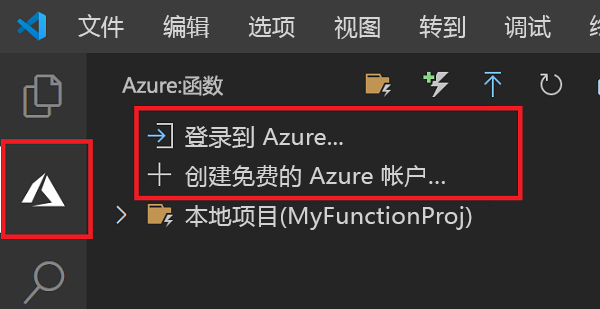

## 登录 Azure

在发布应用之前，必须先登录到 Azure。

1. 在“Azure: Functions”区域中，选择“登录到 Azure...”。如果没有帐户，可以**创建一个免费 Azure 帐户**。

    

1. 出现提示时，选择“复制并打开”，或者复制显示的代码并在浏览器中打开 <https://aka.ms/devicelogin>。

1. 将复制的代码粘贴到“设备登录”页中，验证 Visual Studio Code 的登录信息，然后选择“继续”。  

1. 使用 Azure 帐户凭据完成登录。 成功登录后，可以关闭浏览器。
