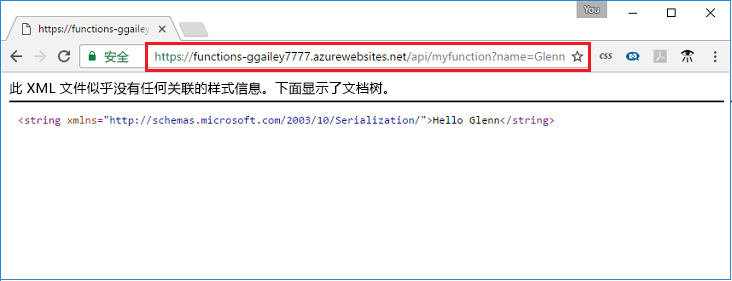

## <a name="test"></a>测试函数

在 Mac 或 Linux 计算机上使用 cURL 或者在 Windows 上使用 Bash 测试已部署的函数。 执行以下 cURL 命令（请将 `<app_name>` 占位符替换为 Function App 的名称）。 在 URL 的后面附加查询字符串 `&name=<yourname>`。

```bash
curl http://<app_name>.azurewebsites.net/api/HttpTriggerJS1?name=<yourname>
```  

  

如果无法在命令行中使用 cURL，请在 Web 浏览器的地址栏中输入相同的 URL。 同样，请将 `<app_name>` 占位符替换为 Function App 的名称，在 URL 的后面附加查询字符串 `&name=<yourname>`，然后执行请求。 

    http://<app_name>.azurewebsites.net/api/HttpTriggerJS1?name=<yourname>
   
  
