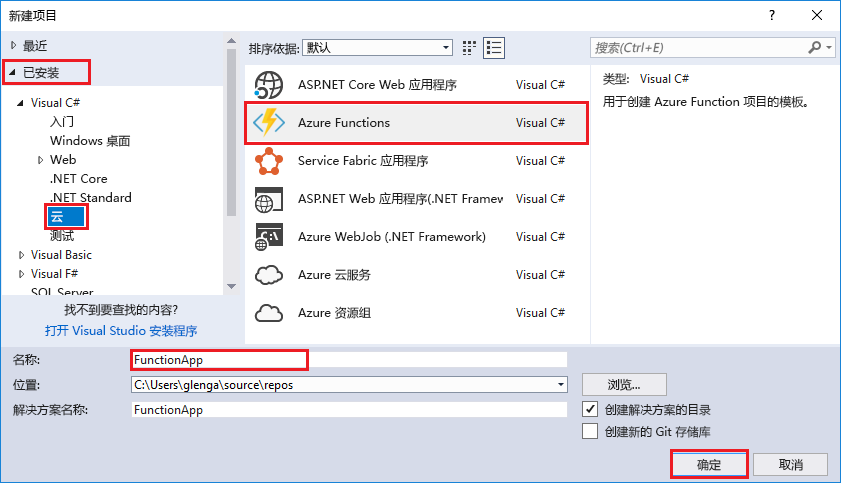

Visual Studio 中的 Azure Functions 项目模板创建一个项目，该项目可发布到 Azure 中的函数应用。 Function App 可让你将函数分组为一个逻辑单元，以便更轻松地管理、部署和共享资源。   

1. 在解决方案资源管理器中右键单击项目节点，然后选择“添加” > “新建项”。 从对话框中选择“Azure Function”。

2. 在“新建项目”对话框中展开“Visual C#” > “云”节点，选择“Azure Functions”，键入项目的“名称”，，然后单击“确定”。 函数应用名称必须可以充当 C# 命名空间，因此请勿使用下划线、连字符或任何其他的非字母数字字符。 

    