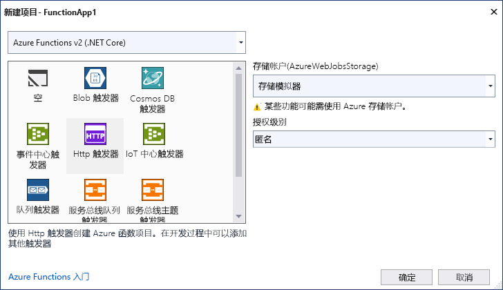

Visual Studio 中的 Azure Functions 项目模板创建了一个项目，该项目可发布到 Azure 中的函数应用。 可使用函数应用将函数分组为逻辑单元，以便更轻松地管理、部署、缩放和共享资源。

1. 在 Visual Studio 菜单中，选择“文件” > “新建” > “项目”。

1. 在“创建新项目”中，在搜索框中输入“functions”，选择“Azure Functions”模板，然后选择“下一步”。

1. 在“配置新项目”中，输入项目的“项目名称”，然后选择“创建”。 函数应用名称必须可以充当 C# 命名空间，因此请勿使用下划线、连字符或任何其他的非字母数字字符。

1. 对于“创建新的 Azure Functions 应用程序”设置，请使用下表中的值：

    | 设置      | 值  | 说明                      |
    | ------------ |  ------- |----------------------------------------- |
    | **Functions 运行时** | **Azure Functions v3  (.NET Core)** | 此值会创建使用 Azure Functions 的版本 3.x 运行时（支持 .NET Core 3.x）的函数项目。 Azure Functions 1.x 支持 .NET Framework。 有关详细信息，请参阅 [Azure Functions 运行时版本概述](../articles/azure-functions/functions-versions.md)。   |
    | **函数模板** | **HTTP 触发器** | 此值会创建由 HTTP 请求触发的函数。 |
    | 存储帐户(AzureWebJobsStorage)  | 存储模拟器 | 由于 Azure 函数需要存储帐户，因此在将项目发布到 Azure 时会分配或创建一个存储帐户。 HTTP 触发器不使用 Azure 存储帐户连接字符串；所有其他触发器类型需要有效的 Azure 存储帐户连接字符串。  |
    | **授权级别** | **匿名** | 在未提供密钥的情况下，任何客户端都可以触发创建的函数。 通过此授权设置可以轻松测试新函数。 有关密钥和授权的详细信息，请参阅[授权密钥](../articles/azure-functions/functions-bindings-http-webhook-trigger.md#authorization-keys)和 [HTTP 和 Webhook 绑定](../articles/azure-functions/functions-bindings-http-webhook.md)。 |
    
    
    

    请确保将“授权级别”设置为“匿名”。  如果选择默认级别的**函数**，需要在请求中提供[函数密钥](../articles/azure-functions/functions-bindings-http-webhook-trigger.md#authorization-keys)才能访问函数终结点。

1. 选择“创建”以创建函数项目和 HTTP 触发器函数。
