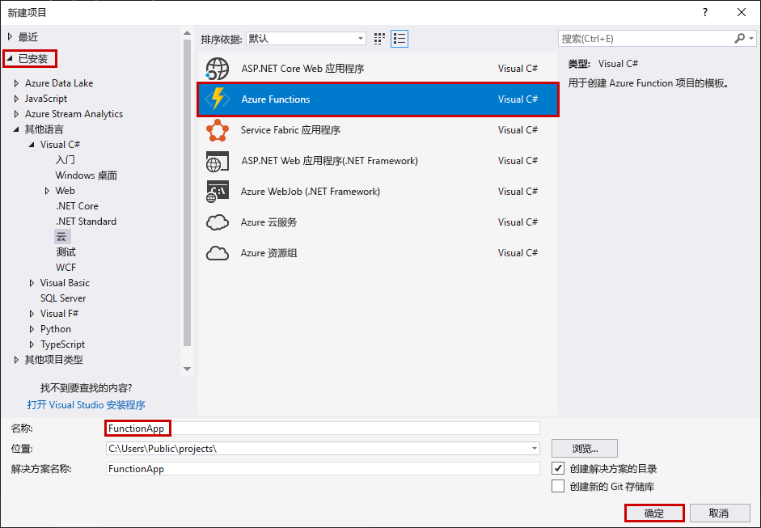
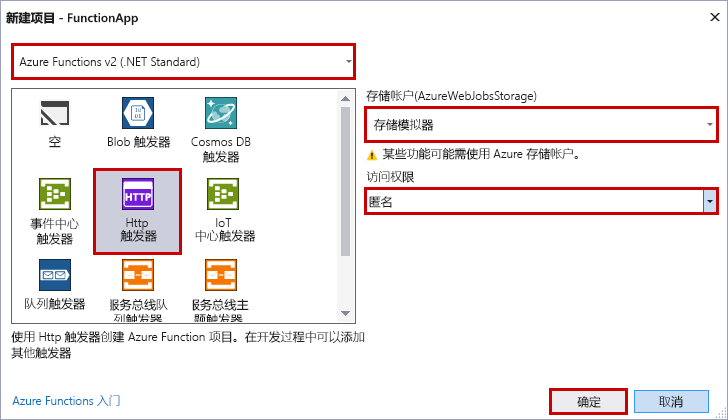

Visual Studio 中的 Azure Functions 项目模板创建一个项目，该项目可发布到 Azure 中的函数应用。 可使用函数应用将函数分组为一个逻辑单元，以用于管理、部署和共享资源。

1. 在 Visual Studio 的“文件”菜单中，依次选择“新建” > “项目”。

2. 在“新建项目”对话框中，依次选择“已安装” > “Visual C#” > “云” > “Azure Functions”。 输入项目的名称，并选择“确定”。 函数应用名称必须可以充当 C# 命名空间，因此请勿使用下划线、连字符或任何其他的非字母数字字符。

    

3. 使用图像后的表中指定的设置。

     

    | 设置      | 建议的值  | Description                      |
    | ------------ |  ------- |----------------------------------------- |
    | **版本** | Azure Functions 2.x  (.NET Core) | 此设置创建使用 Azure Functions 运行时版本 2.x（支持 .NET Core）的函数项目。 Azure Functions 1.x 支持 .NET Framework。 有关详细信息，请参阅[面向 Azure Functions 运行时版本](../articles/azure-functions/functions-versions.md)。   |
    | **模板** | HTTP 触发器 | 此设置创建由 HTTP 请求触发的函数。 |
    | **存储帐户**  | 存储模拟器 | HTTP 触发器不使用 Azure 存储帐户连接。 所有其他触发器类型需要有效的存储帐户连接字符串。 |
    | **访问权限** | 匿名 | 在未提供密钥的情况下，任何客户端都可以触发创建的函数。 通过此授权设置可以轻松测试新函数。 有关密钥和授权的详细信息，请参阅 [HTTP 和 Webhook 绑定](../articles/azure-functions/functions-bindings-http-webhook.md)中的[授权密钥](../articles/azure-functions/functions-bindings-http-webhook.md#authorization-keys)。 |
    
    > [!NOTE]
    > 确保将“访问权限”设置为 `Anonymous`。 如果选择默认级别为 `Function`，需要在请求中提供[函数密钥](../articles/azure-functions/functions-bindings-http-webhook.md#authorization-keys)才能访问函数终结点。
    
4. 选择“确定”以创建函数项目和 HTTP 触发的函数。
