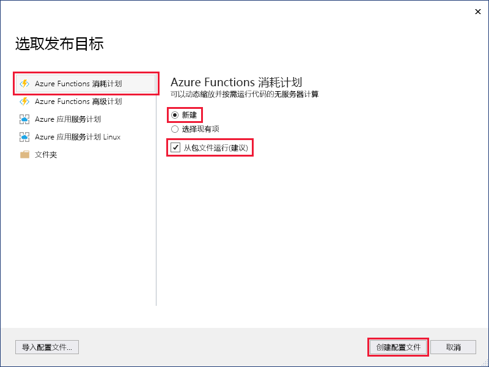
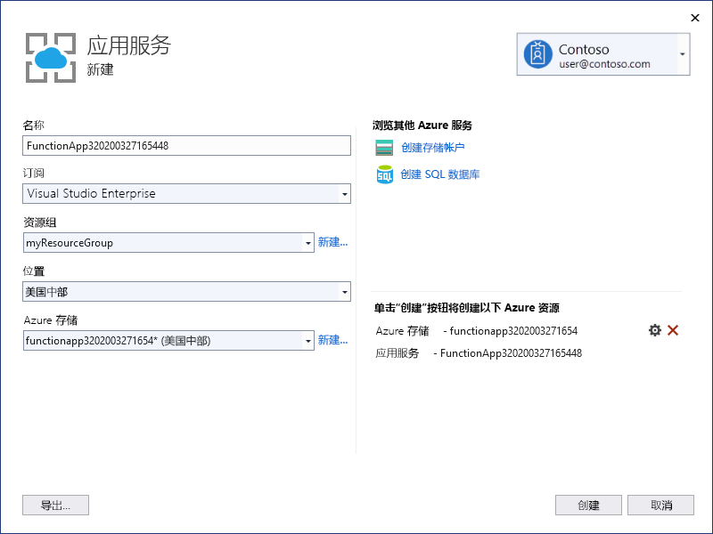

1. **在“解决方案资源管理器”** 中，右键单击该项目并选择“发布”  。

2. 在“选取发布目标”  对话框中，使用图片下方的表中指定的发布选项： 

    

    | 选项      | 说明                                |
    | ------------ |  -------------------------------------------------- |
    | **Azure Functions 消耗计划** |   将项目发布到在[消耗计划](../articles/azure-functions/functions-scale.md#consumption-plan)中运行的函数应用时，只需为函数应用的执行付费。 其他托管计划会产生更高的成本。 若要了解更多信息，请参阅 [Azure Functions 的缩放和托管](../articles/azure-functions/functions-scale.md)。 | 
    | **新建** | 在 Azure 中创建具有相关资源的新函数应用。 选择“选择现有”  时，Azure 中现有函数应用中的所有文件都将被本地项目中的文件覆盖。 仅在将更新重新发布到现有函数应用时才使用此选项。 |
    | **从包文件运行** | 启用[从包运行](../articles/azure-functions/run-functions-from-deployment-package.md)模式，函数应用将使用 [Zip 部署](../articles/azure-functions/functions-deployment-technologies.md#zip-deploy)进行部署。 建议通过这种方式来运行函数，可以提高性能。 如果未使用此选项，请确保在函数应用发布到 Azure 之前，先停止其在本地的运行。 |

3. 选择“发布”  。 如果尚未从 Visual Studio 登录到 Azure 帐户，请选择“登录”  。 也可以创建免费 Azure 帐户。

4. 在“Azure 应用服务:  新建”对话框中，使用图片下方的表中指定的“托管”设置： 

    

    | 设置      | 建议的值  | 说明                                |
    | ------------ |  ------- | -------------------------------------------------- |
    | **名称** | 全局唯一名称 | 用于唯一标识新 Function App 的名称。 有效的字符是 `a-z`、`0-9` 和 `-`。 |
    | **订阅** | 选择自己的订阅 | 要使用的 Azure 订阅。 |
    |  [资源组](../articles/azure-resource-manager/management/overview.md) | myResourceGroup |  要在其中创建 Function App 的资源组的名称。 选择“新建”  创建新的资源组。|
    | **[托管计划](../articles/azure-functions/functions-scale.md)** | 消耗计划 | 选择“新建”  创建无服务器计划后，确保在“大小”  下选择“消耗量”  。 此外，选择离你近或离函数访问的其他服务近的[区域](https://azure.microsoft.com/regions/)中的**位置**。 在“消耗量”之外的计划中运行时，必须管理[函数应用的缩放](../articles/azure-functions/functions-scale.md)。   |
    | **[Azure 存储](../articles/storage/common/storage-account-create.md)** | 常规用途存储帐户 | Functions 运行时需要 Azure 存储帐户。 选择“新建”以创建常规用途存储帐户。  也可使用符合[存储帐户要求](../articles/azure-functions/functions-scale.md#storage-account-requirements)的现有帐户。  |

5. 选择“创建”  以使用这些设置在 Azure 中创建函数应用和相关资源，并部署函数项目代码。 

6. 完成部署后，请记下“站点 URL”  值，这是函数应用在 Azure 中的地址。

    
