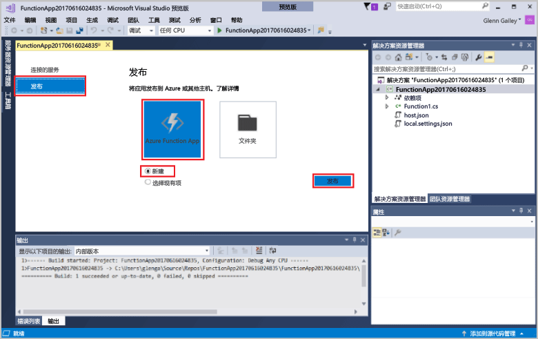
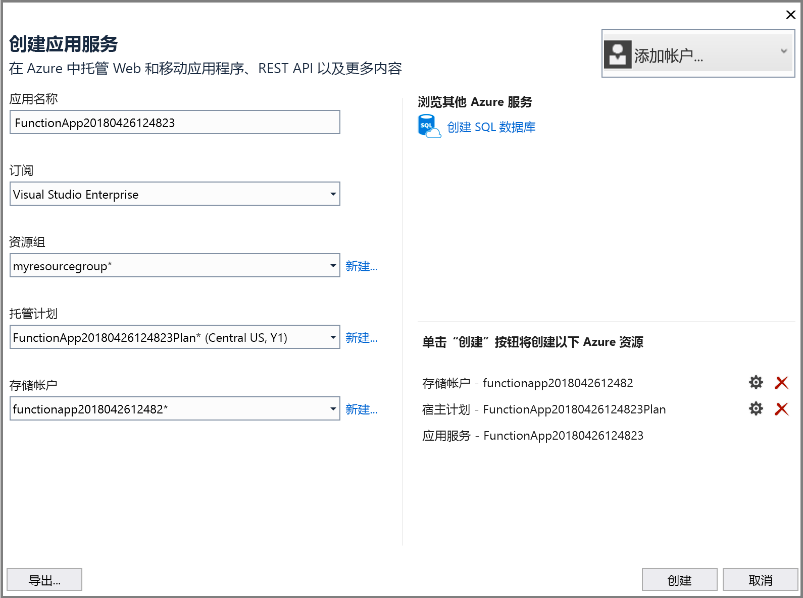
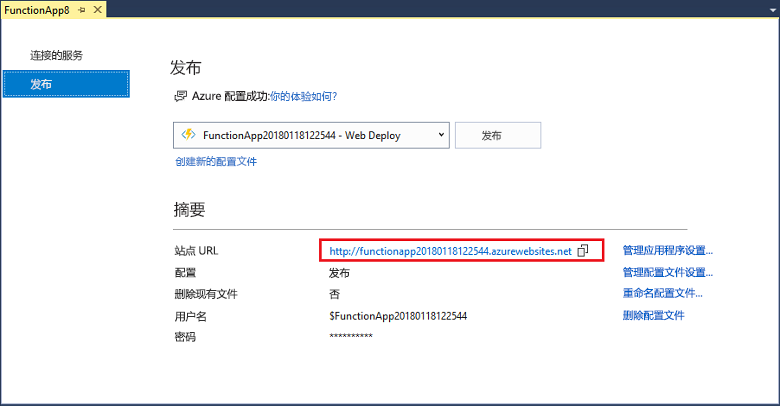

1. **在“解决方案资源管理器”**中，右键单击该项目并选择“发布”。 依次选择“新建”、“发布”。 

    

2. 如果尚未将 Visual Studio 连接到 Azure 帐户，请选择“添加帐户...”。  

3. 在“创建应用服务”对话框中，使用在下表中指定的“托管”设置： 

    

    | 设置      | 建议的值  | 说明                                |
    | ------------ |  ------- | -------------------------------------------------- |
    | **应用名称** | 全局唯一名称 | 用于唯一标识新 Function App 的名称。 |
    | **订阅** | 选择订阅 | 要使用的 Azure 订阅。 |
    | [资源组](../articles/azure-resource-manager/resource-group-overview.md) | myResourceGroup |  要在其中创建 Function App 的资源组的名称。 选择“新建”创建新的资源组。|
    | **[应用服务计划](../articles/azure-functions/functions-scale.md)** | 消耗量计划 | 单击“新建”创建新计划后，确保在“大小”下选择“消耗量”。 此外，选择离你近或离函数访问的其他服务近的[区域](https://azure.microsoft.com/regions/)中的**位置**。  |

    >[!NOTE]
    >Functions 运行时需要 Azure 存储帐户。 因此，当你创建函数应用时，系统会为你创建一个新的 Azure 存储帐户。

4. 单击“创建”以使用这些设置在 Azure 中创建函数应用和相关资源，并部署函数项目代码。 

5. 完成部署后，请记下“站点 URL”值，这是函数应用在 Azure 中的地址。

    
