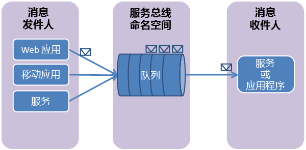

## 什么是 Service Bus 队列？
服务总线队列支持**中转消息传送**通信模型。 在使用队列时，分布式应用程序组件不能直接与每个其他;而是通过充当中介 （代理） 的队列的消息交换它们。 消息创建方 （发送方） 将传送到队列的消息，然后继续对其进行处理。 以异步方式，消息使用者 （接收方） 从队列提取消息并处理它。 创建方不必等待使用者的答复即可继续处理并发送更多消息。 队列提供**第一个中，先出 (FIFO)**消息传递到一个或多个竞争的使用者。 也就是说，消息通常接收和处理的顺序在其中添加到队列，并且每条消息是接收和处理由一个消息使用者接收方。

Service Bus 队列是一种可用于各种方案通用技术：

* 多层 Azure 应用程序中的 web 和辅助角色之间的通信。
* 在本地和混合解决方案中的 Azure 托管应用程序之间的通信。
* 在本地运行在不同组织或组织的各部门中的分布式应用程序组件之间的通信。

使用队列，可更轻松地缩放您的应用程序并启用你的体系结构的弹性。

