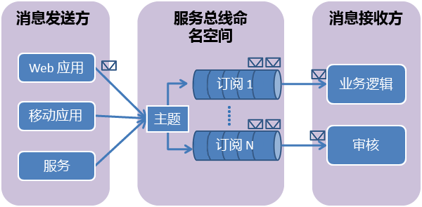

## 什么是服务总线主题和订阅？
服务总线主题和订阅支持 *发布/订阅* 消息通信模型。 在使用主题和订阅时，分布式应用程序的组件不会直接相互通信，而是通过充当中介的主题交换消息。

与每条消息都由单个使用方处理的服务总线队列相比，主题和订阅通过发布/订阅模式提供“一对多”通信方式。 可向一个主题注册多个订阅。 当消息发送到主题时，每个订阅会分别对该消息进行处理。

主题订阅类似于接收发送至该主题的消息副本的虚拟队列。 可以根据每个订阅有选择地为主题注册筛选规则，这样就可以筛选或限制哪些主题订阅接收发送至某个主题的哪些消息。

利用服务总线主题和订阅，可以扩展和处理许多用户和应用程序之间存在的大量消息。

## 创建命名空间
若要开始在 Azure 中使用服务总线主题和订阅，必须先创建一个 *服务命名空间*。 命名空间提供了用于对应用程序中的 Service Bus 资源进行寻址的范围容器。

创建命名空间：

1. 登录到 [Azure 门户][Azure portal]。
2. 在门户的左侧导航窗格中，依次单击“新建”、“企业集成”和“服务总线”。
3. 在“创建命名空间”  对话框中，输入命名空间名称。 系统会立即检查该名称是否可用。
4. 在确保命名空间名称可用后，选择定价层（基础版、标准版或高级版）。
5. 在“订阅”  字段中，选择要创建命名空间的 Azure 订阅。
6. 在“资源组”字段中，选择将保留命名空间的现有资源组，或者创建一个新资源组。      
7. 在“位置” 中，选择应托管命名空间的国家或地区。
   
    ![创建命名空间][create-namespace]
8. 单击“创建”  按钮。 系统现已创建命名空间并已将其启用。 可能需要等待几分钟，因为系统将为帐户配置资源。

### 获取凭据
1. 在命名空间列表中，单击新创建的命名空间名称。
2. 在“服务总线命名空间”边栏选项卡中，单击“共享访问策略”。
3. 在“共享访问策略”边栏选项卡中，单击“RootManageSharedAccessKey”。
   
    ![connection-info][connection-info]
4. 在“策略: RootManageSharedAccessKey”边栏选项卡中，单击“连接字符串 - 主键”旁边的复制按钮，将连接字符串复制到剪贴板供以后使用。
   
    ![connection-string][connection-string]

[Azure portal]: https://portal.azure.com
[create-namespace]: ./media/howto-service-bus-topics/create-namespace.png
[connection-info]: ./media/howto-service-bus-topics/connection-info.png
[connection-string]: ./media/howto-service-bus-topics/connection-string.png

