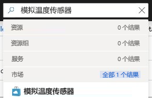

Azure IoT Edge 的主要功能之一是能够从云中将模块部署到 IoT Edge 设备。 IoT Edge 模块是以容器形式实现的可执行包。 在本部分中，我们将从 [Azure 市场的“IoT Edge 模块”部分](https://azuremarketplace.microsoft.com/en-us/marketplace/apps/category/internet-of-things?page=1&subcategories=iot-edge-modules)部署一个预建的模块。 此模块将生成模拟设备的遥测数据。

1. 在 Azure 门户中，在搜索中输入 `Simulated Temperature Sensor` 并打开市场结果。

   

2. 在“订阅”字段中，选择包含你使用的 IoT 中心的订阅（如果尚未选择）。

3. 在“IoT 中心”字段中，选择你使用的 IoT 中心的名称（如果尚未选择）。

4. 单击“查找设备”，选择你的 IoT Edge 设备（名为 `myEdgeDevice`），然后选择“创建”。

5. 在向导的“添加模块”步骤中，单击“SimulatedTemperatureSensor”模块以验证其配置设置，单击“保存”并选择“下一步”。

6. 在向导的“指定路由”步骤中，验证是否在路由中正确设置了将来自所有模块的所有消息都发送到 IoT 中心 (`$upstream`) 的默认路由。 如果没有，请添加以下代码，然后选择“下一步”。

   ```json
    {
    "routes": {
        "route": "FROM /messages/* INTO $upstream"
        }
    }
   ```

7. 在向导的“查看部署”步骤中，选择“提交”。

8. 返回到“设备详细信息”页，并选择“刷新”。 除了首次启动该服务时创建的 edgeAgent 模块之外，应当还会看到名为 **edgeHub** 的另一个运行时模块以及 **SimulatedTemperatureSensor** 模块列出。

   新模块显示可能需要数分钟。 IoT Edge 设备必须从云检索其新的部署信息，启动容器，然后将其新的状态报告回 IoT 中心。 

   
