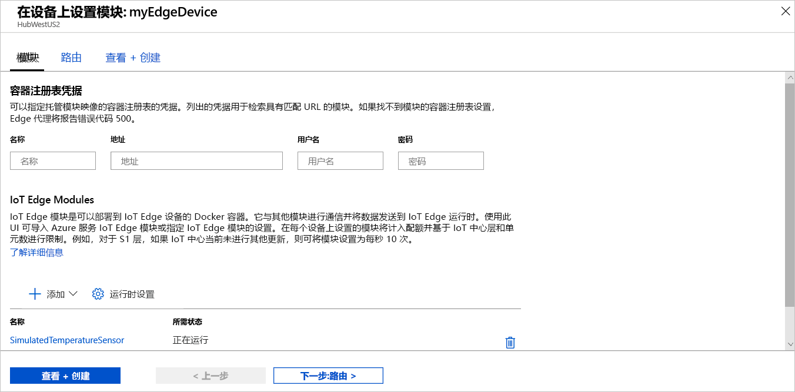
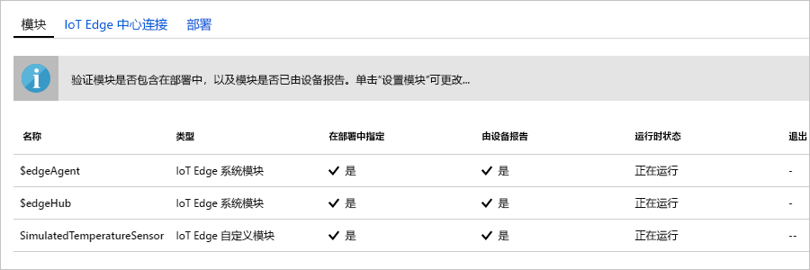

Azure IoT Edge 的主要功能之一是能够从云中将代码部署到 IoT Edge 设备。 **IoT Edge 模块**是以容器形式实现的可执行程序包。 在本部分中，你将直接从 Azure IoT 中心的 [Azure 市场的 IoT Edge 模块部分](https://azuremarketplace.microsoft.com/marketplace/apps/category/internet-of-things?page=1&subcategories=iot-edge-modules)部署一个预建的模块。

在本部分中部署的模块模拟一个传感器并发送生成的数据。 开始使用 IoT Edge 时，此模块是非常有用的代码段，因为你可以使用模拟的数据进行开发和测试。 如果要确切了解此模块的功能，则可以查看[模拟的温度传感器源代码](https://github.com/Azure/iotedge/blob/027a509549a248647ed41ca7fe1dc508771c8123/edge-modules/SimulatedTemperatureSensor/src/Program.cs)。

若要从 Azure 市场部署你的第一个模块，请使用以下步骤：

1. 登录 [Azure 门户](https://portal.azure.com)，导航到 IoT 中心。

1. 从左窗格菜单中的“自动设备管理”下，选择“IoT Edge”   。

1. 单击设备列表中目标设备的设备 ID。

1. 在上方栏中，选择“设置模块”  。

1. 在页面的“IoT Edge 模块”部分中，单击“添加”   。

1. 从下拉菜单中选择“市场模块”  。

   

1. 在“IoT Edge 模块市场”中，搜索“模拟温度传感器”并选择该模块  。

1. 请注意，SimulatedTemperatureSensor 模块已自动填充。 在教程中，将使用此页向部署添加其他模块。 对于本快速入门，只需要部署这一个模块。 不需要任何凭据，因为它是公共的。

   

   在完成时选择“下一步:  ”路由以继续执行向导的下一步。

1. 在向导的“路由”选项卡中，定义消息在模块和 IoT 中心之间传递的方式  。 消息由名称/值对构造。 对于本快速入门，需要来自所有模块的所有消息都转到 IoT 中心 (`$upstream`)。 如果未自动填充，请为“名称”为 `upstream` 的“值”添加以下代码   ：

   ```sql
    FROM /messages/* INTO $upstream
   ```

   在完成时选择“下一步:  查看 + 创建”继续执行向导的下一步。

1. 在向导的“查看 + 创建”选项卡中，可以预览定义部署到 IoT Edge 设备的所有模块的 JSON 文件  。 请注意，包括 **SimulatedTemperatureSensor** 模块以及名为 **edgeAgent** 和 **edgeHub** 的两个其他系统模块。 完成查看后，选择“创建”  。

   在将新部署提交到 IoT Edge 设备时，不会向设备推送任何内容。 相反，设备会定期对 IoT 中心进行查询以获取任何新指令。 如果设备找到了更新的部署清单，则它会使用关于新部署的信息来从云中拉取模块映像，然后开始在本地运行模块。 此过程可能需要几分钟时间。

1. 创建模块部署详细信息后，向导将引导你返回到 IoT 中心的 IoT Edge 页  。 从 IoT Edge 设备列表中选择设备，以查看其详细信息。

1. 在设备详细信息页上，向下滚动至“模块”选项卡  。应有三个模块列出：$edgeAgent、$edgeHub 和 SimulatedTemperatureSensor。 如果列出了部署中指定的一个或多个模块，但设备未报告这些模块，则意味着 IoT Edge 设备仍在启动它们。 请稍等片刻，然后选择页面顶部的“刷新”  。

   
