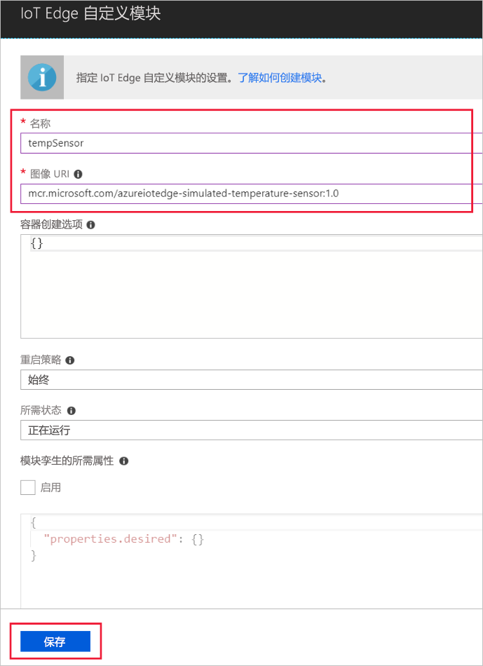

Azure IoT Edge 的主要功能之一是能够从云中将模块部署到 IoT Edge 设备。 IoT Edge 模块是以容器形式实现的可执行包。 在此部分中，将为模拟设备部署用于生成遥测数据的模块。 

1. 在 Azure 门户中导航到 IoT 中心。
1. 转到“IoT Edge”，然后选择 IoT Edge 设备。
1. 选择“设置模块”。
1. 在页面的“部署模块”部分中，单击“添加”，然后选择“IoT Edge 模块”。
1. 在“名称”字段中，输入 `tempsensor`。 
1. 在“映像 URI”字段中，输入 `mcr.microsoft.com/azureiotedge-simulated-temperature-sensor:1.0`。 
1. 将其他设置保留不变，然后选择“保存”。

   

1. 返回到“添加模块”步骤，选择“下一步”。
1. 在“指定路由”步骤中，应当已有一个默认路由，它将来自所有模块的所有消息都发送到 IoT 中心。 如果没有，请添加以下代码，然后选择“下一步”。

   ```json
   {
       "routes": {
           "route": "FROM /* INTO $upstream"
       }
   }
   ```

1. 在“复查部署”步骤中，选择“提交”。
1. 返回到“设备详细信息”页，并选择“刷新”。 除了首次启动该服务时创建的 edgeAgent 模块之外，应当还会看到名为 **edgeHub** 的另一个运行时模块以及 **tempSensor** 模块列出。 

   
