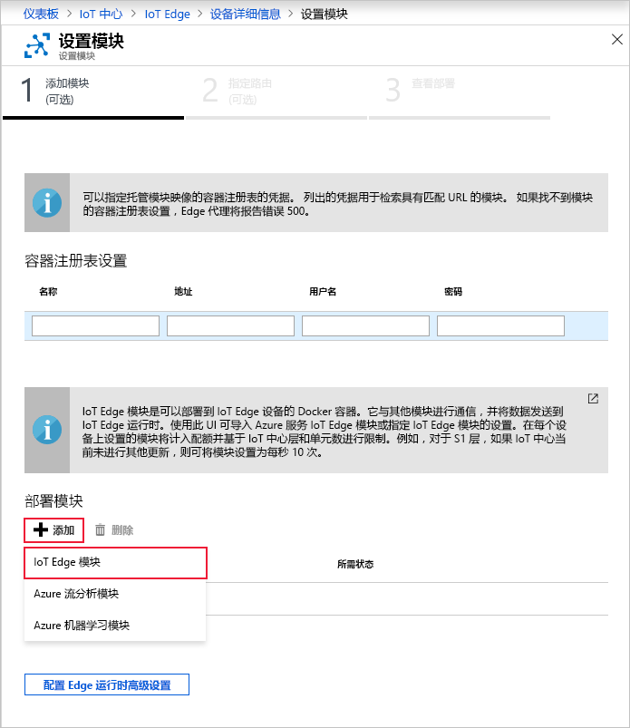

Azure IoT Edge 的主要功能之一是能够从云中将模块部署到 IoT Edge 设备。 IoT Edge 模块是以容器形式实现的可执行包。 在此部分中，将为模拟设备部署用于生成遥测数据的模块。

1. 在 Azure 门户中导航到 IoT 中心。

2. 转到“设备自动管理”下的“IoT Edge”，选择 IoT Edge 设备。

3. 选择“设置模块”。 此时会在门户中打开一个三步向导，引导你添加模块、指定路由和查看部署。 

4. 在向导的“添加模块”步骤中，找到“部署模块”部分。 单击“添加”，然后选择“IoT Edge 模块”。

   

5. 在“名称”字段中，输入 `tempSensor`。

6. 在“映像 URI”字段中，输入 `mcr.microsoft.com/azureiotedge-simulated-temperature-sensor:1.0`。

7. 将其他设置保留不变，然后选择“保存”。

   

8. 回到向导的第一步，选择“下一步”。

9. 在向导的“指定路由”步骤中，应当已有一个默认路由，它将来自所有模块的所有消息都发送到 IoT 中心。 如果没有，请添加以下代码，然后选择“下一步”。

   ```json
   {
       "routes": {
           "route": "FROM /messages/* INTO $upstream"
       }
   }
   ```

10. 在向导的“查看部署”步骤中，选择“提交”。

11. 返回到“设备详细信息”页，并选择“刷新”。 除了首次启动该服务时创建的 edgeAgent 模块之外，应当还会看到名为 **edgeHub** 的另一个运行时模块以及 **tempSensor** 模块列出。

   新模块显示可能需要数分钟。 IoT Edge 设备必须从云检索其新的部署信息，启动容器，然后将其新的状态报告回 IoT 中心。 

   
