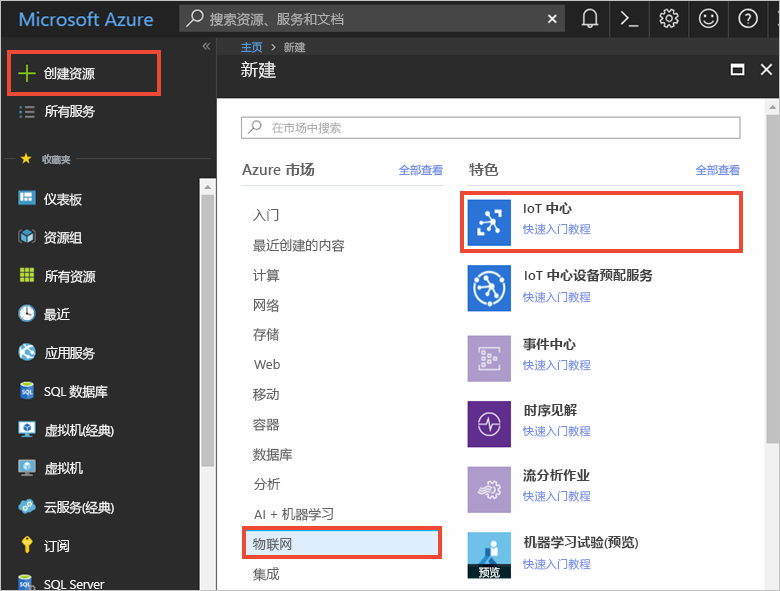
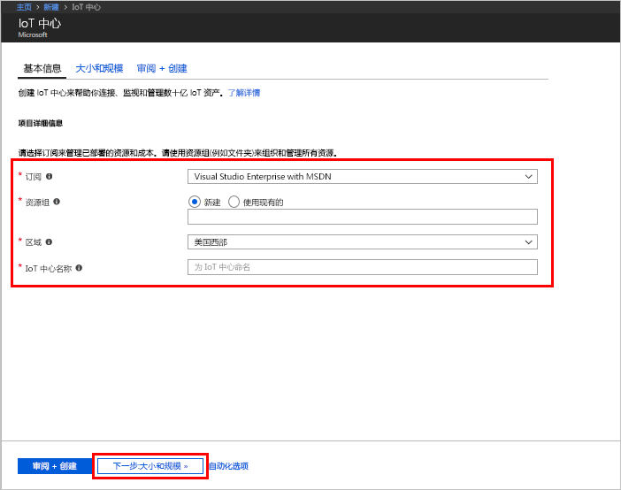
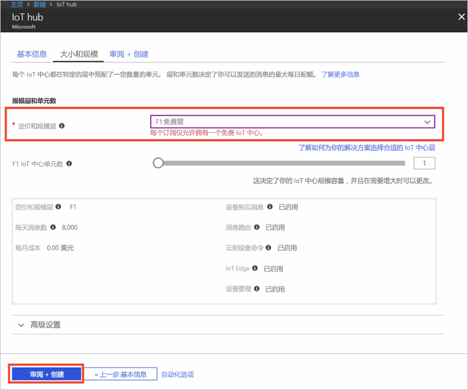

1. 登录到 [Azure 门户](https://portal.azure.com/)。

2. 选择“创建资源” > “物联网” > “IoT 中心”。
   
    

3. 在“IoT 中心”窗格中，输入 IoT 中心的以下信息：

   * **订阅**：选择需要将其用于创建此 IoT 中心的订阅。

   * **资源组**：创建用于托管 IoT 中心的资源组，或使用现有的资源组。 有关详细信息，请参阅[使用资源组管理 Azure 资源](../articles/azure-resource-manager/resource-group-portal.md)。

   * **区域**：选择最近的位置。

   * **名称**：创建 IoT 中心的名称。 如果输入的名称可用，会显示一个绿色复选标记。

   [!INCLUDE [iot-hub-pii-note-naming-hub](iot-hub-pii-note-naming-hub.md)]

   

4. 选择“下一步: 大小和规模”，以便继续创建 IoT 中心。 

5. 选择“定价和缩放层”。 就本文来说，请选择“F1 - 免费”层（前提是此层在订阅上仍然可用）。 有关详细信息，请参阅[定价和缩放层](https://azure.microsoft.com/pricing/details/iot-hub/)。

   

6. 选择“查看 + 创建”。

7. 查看 IoT 中心信息，然后单击“创建”。 创建 IoT 中心可能需要数分钟的时间。 可在“通知”窗格中监视进度。