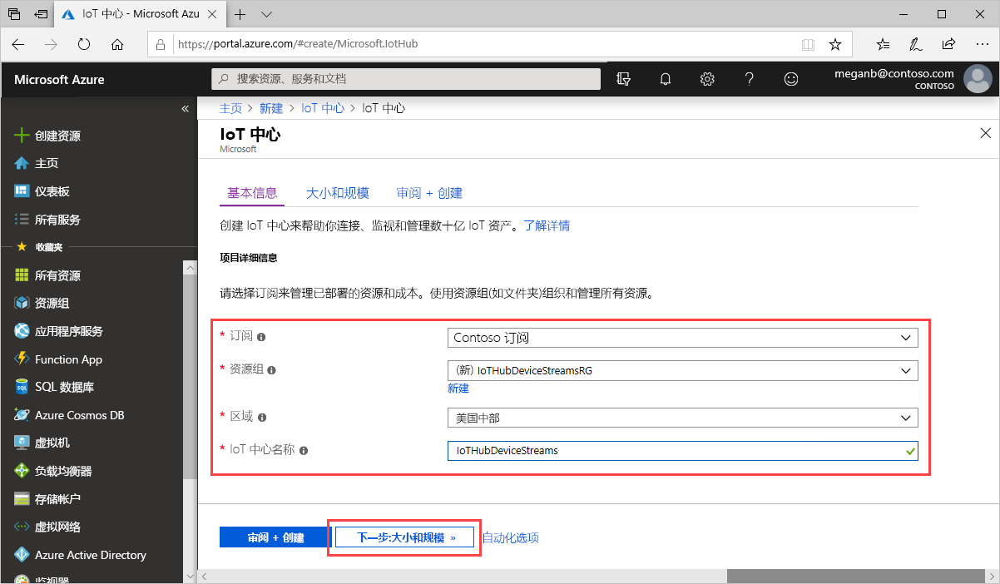

此部分介绍如何使用 [Azure 门户](https://portal.azure.com)创建 IoT 中心。

1. 登录 [Azure 门户](https://portal.azure.com)。

1. 选择“创建资源”，然后在“搜索市场”字段中输入“IoT 中心”。   

1. 在搜索结果中选择“IoT 中心”，然后选择“创建”   。

1. 在“基本信息”选项卡上，按如下所示填写字段： 

   - **订阅**：选择要用于中心的订阅。

   - **资源组**：选择一个资源组或新建一个资源组。 若要新建资源组，请选择“新建”并填写要使用的名称。  若要使用现有的资源组，请选择它。 有关详细信息，请参阅[管理 Azure 资源管理器资源组](../articles/azure-resource-manager/management/manage-resource-groups-portal.md)。

   - **区域**：选择你希望中心所在的区域。 选择支持 IoT 中心设备流预览版的区域：“美国中部”或“美国中部 EUAP”。  

   - **IoT 中心名称**：输入中心的名称。 该名称必须全局唯一。 如果输入的名称可用，会显示一个绿色复选标记。

   

   [!INCLUDE [iot-hub-pii-note-naming-hub](iot-hub-pii-note-naming-hub.md)]

1. 在完成时选择“下一步:  大小和规模”，以继续创建中心。

   

   在“大小和规模”中，可以接受默认设置并选择底部的“查看 + 创建”。   请考虑以下选项：

   - **定价和缩放层**：选择的层。 选择一个标准层（**S1**、**S2** 或 **S3**）或“F1:  免费层”。 也可根据队列大小以及预期在中心会出现的非流式处理工作负荷（例如遥测消息）完成该选择。 例如，免费层适用于测试和评估。 它允许 500 台设备连接到 IoT 中心，并且每天最多传输 8,000 条信息。 每个 Azure 订阅可以在免费层中创建一个 IoT 中心。 

   - **IoT 中心单元数量**：每日每单位允许的消息数取决于中心的定价层。 此项选择取决于中心内预期会出现的非流式处理工作负荷。 暂时可以选择“1”。

   - **高级设置** > **设备到云的分区**：此属性将设备到云消息与这些消息的同步读取器数目相关联。 大多数中心只需要 4 个分区。

   有关层选项的详细信息，请参阅[选择适当的 IoT 中心层](../articles/iot-hub/iot-hub-scaling.md)。

1. 若要查看选择，请选择“查看 + 创建”  。 结果将如下所示：

   

1. 若要创建新的 IoT 中心，请选择“创建”  。 该过程需要花费几分钟时间。
