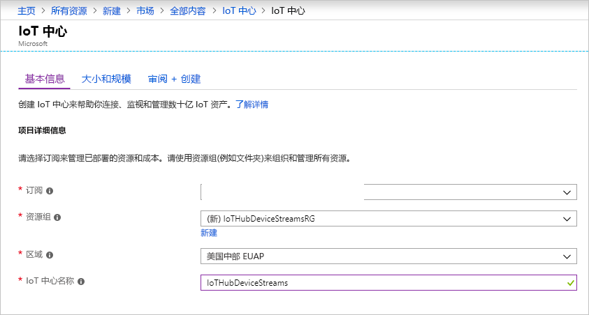
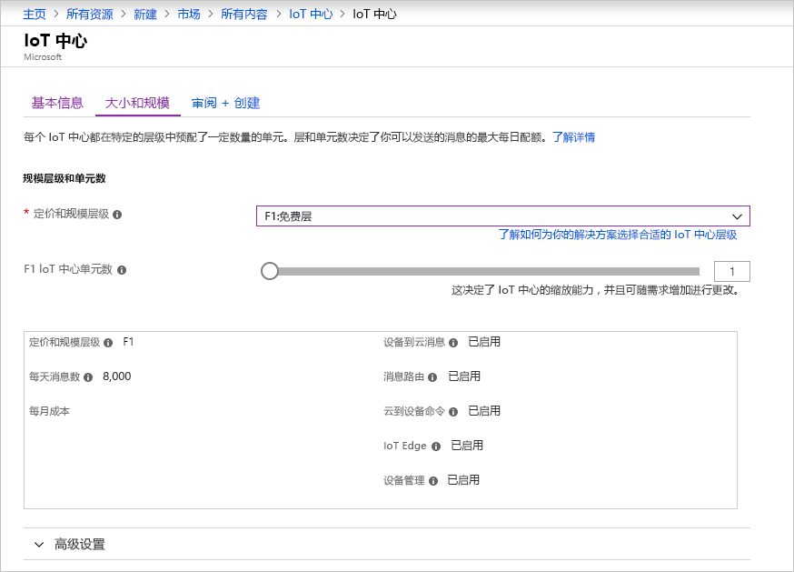
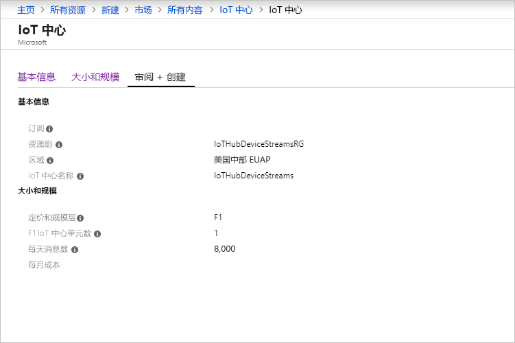

本部分介绍如何使用 [Azure 门户](https://portal.azure.com)创建 IoT 中心。

1. 登录到 [Azure 门户](https://portal.azure.com)。

1. 选择“创建资源”，然后选择“物联网”。  

1. 在右侧的列表中选择“IoT 中心”。  此时会打开用于创建 IoT 中心的第一个页面。

   

   填写字段：

   a. 在“订阅”下拉列表中，选择要用于 IoT 中心的订阅。 

   b. 对于“资源组”，请执行以下操作之一：  
      * 若要创建新的资源组，请选择“新建”，然后输入所需的名称  。 
      * 若要使用现有资源组，请选择“使用现有项”，然后在下拉列表中选择该资源组。  
      
        有关详细信息，请参阅[管理 Azure 资源管理器资源组](../articles/azure-resource-manager/manage-resource-groups-portal.md)。

   c. 在“区域”下拉列表中，选择要在其中创建中心的区域。  选择支持 IoT 中心设备流预览版的区域：“美国中部”或“美国中部 EUAP”。  

   d. 在“IoT 中心名称”框中，输入 IoT 中心的名称。  该名称必须全局唯一。 如果输入的名称可用，会显示一个绿色复选标记。

   [!INCLUDE [iot-hub-pii-note-naming-hub](iot-hub-pii-note-naming-hub.md)]

1. 若要继续创建 IoT 中心，请选择“下一步:  大小和规模”。

   

   在此窗格中，可以接受默认设置并选择底部的“查看 + 创建”。  请考虑以下选项：

   * 在“定价和规模层”下拉列表中，选择一个标准层（“S1”、“S2”或“S3”），或选择“F1:      免费层”。 也可根据队列大小以及预期在中心会出现的非流式处理工作负荷（例如遥测消息）完成该选择。 例如，免费层适用于测试和评估。 它允许 500 台设备连接到 IoT 中心，并且每天最多传输 8,000 条信息。 每个 Azure 订阅可以在免费层中创建一个 IoT 中心。 

   * 对于“IoT 中心单元数”：  此项选择取决于中心内预期会出现的非流式处理工作负荷。 暂时可以选择“1”。

   有关层选项的详细信息，请参阅[选择适当的 IoT 中心层](../articles/iot-hub/iot-hub-scaling.md)。

1. 若要检查所做的选择，请选择“查看+创建”选项卡。  此时会打开如下所示的窗格：

   

1. 若要创建新的 IoT 中心，请选择“创建”  。 该过程需要花费几分钟时间。
