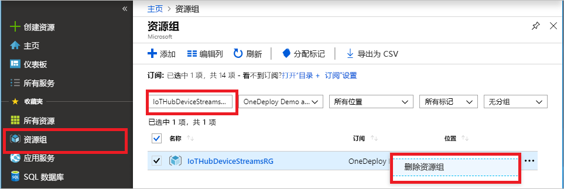

如果你打算继续学习下一篇建议的文章，可以保留并重复使用已创建的资源。

否则，可以删除本文中创建的 Azure 资源，以避免产生费用。

> [!IMPORTANT]
> 删除资源组的操作不可逆。 资源组以及包含在其中的所有资源将被永久删除。 请确保不要意外删除错误的资源组或资源。 如果在现有的包含要保留资源的资源组中创建了 IoT 中心，请只删除 IoT 中心资源本身，而不要删除资源组。
>

若要按名称删除资源组，请执行以下操作：

1. 登录到 [Azure 门户](https://portal.azure.com)，然后选择“资源组”。 

1. 在“按名称筛选”框中，输入包含你的 IoT 中心的资源组的名称。 

1. 在结果列表中你的资源组的右侧，选择 ( **...** )，然后选择“删除资源组”  。

    

1. 若要确认删除该资源组，请重新输入资源组名称，然后选择“删除”。  片刻之后，将会删除该资源组及其包含的所有资源。
