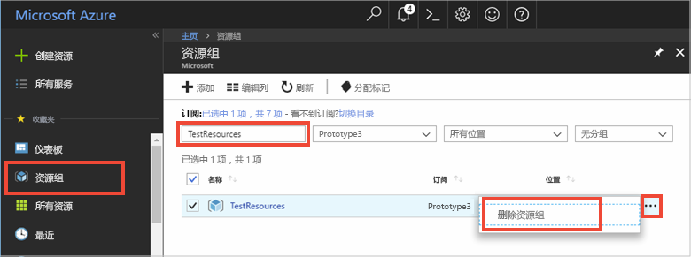

如果想要继续学习下一篇建议的文章，可以保留已创建的资源，以便重复使用。

否则，可删除本文中创建的 Azure 资源，避免收费。 

> [!IMPORTANT]
> 删除资源组的操作不可逆。 资源组以及包含在其中的所有资源将被永久删除。 请确保不会意外删除错误的资源组或资源。 如果在现有的包含要保留资源的资源组中创建了 IoT 中心，则只删除 IoT 中心资源本身，而不要删除资源组。
>

若要按名称删除资源组，请执行以下操作：

1. 登录到 [Azure 门户](https://portal.azure.com)，并单击“资源组”。 

2. 在“按名称筛选...”文本框中键入包含 IoT 中心的资源组的名称  。 

3. 在结果列表中的资源组右侧，单击“...”，然后单击“删除资源组”   。

    

4. 系统会要求确认是否删除资源组。 再次键入资源组的名称进行确认，然后单击“删除”  。 片刻之后，将会删除该资源组及其包含的所有资源。