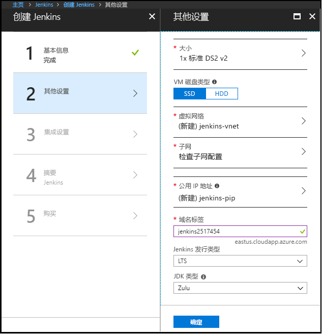

1. 在浏览器中，打开[适用于 Jenkins 的 Azure Marketplace 映像](https://azuremarketplace.microsoft.com/marketplace/apps/azure-oss.jenkins?tab=Overview)。

1. 选择“立即获取”。

    

1. 在查看定价详细信息和条款信息后，选择“继续”。

    

1. 选择“创建”可在 Azure 门户中配置 Jenkins 服务器。 

    

1. 在“基本”选项卡上，指定以下值：

    - **名称** - 输入 `Jenkins`。
    - **用户名** - 输入登录到运行 Jenkins 的虚拟机时要使用的用户名。 用户名称必须满足[特定要求](/azure/virtual-machines/linux/faq#what-are-the-username-requirements-when-creating-a-vm)。
    - **身份验证类型** - 选择“SSH 公钥”。
    - **SSH 公钥** - 以单行格式（以 `ssh-rsa` 开头）或多行 PEM 格式复制并粘贴 RSA 公钥。 可以在 Linux 和 macOS 上使用 ssh-keygen 生成 SSH 密钥，或在 Windows 上使用 PuTTYGen 生成这些密钥。 有关 SSH 密钥和 Azure 的详细信息，请参阅[如何在 Azure 上将 SSH 密钥与 Windows 配合使用](/azure/virtual-machines/linux/ssh-from-windows)一文。
    - **订阅** - 选择要用于安装 Jenkins 的 Azure 订阅。
    - **资源组** - 选择“新建”，并输入资源组的名称，该资源组用作构成 Jenkins 安装的资源集合的逻辑容器。
    - **位置** - 选择“美国东部”。

    

1. 选择“确定”以进入“其他设置”选项卡。 

1. 在“其他设置”选项卡中，指定以下值：

    - **大小** - 选择适合于 Jenkins 虚拟机的调整大小选项。
    - **VM 磁盘类型** - 指定 HDD（硬盘驱动器）或 SSD（固态驱动器）以指明允许将哪种存储磁盘类型用于 Jenkins 虚拟机。
    - **虚拟网络** -（可选）选择要修改默认设置的**虚拟网络**。
    - **子网** - 选择“子网”，验证信息，然后选择“确定”。
    - **公共 IP 地址** - IP 地址名称默认为在前一页中指定的带有 -IP 后缀的 Jenkins 名称。 可以选择相应选项更改该默认设置。
    - **域名标签** - 为 Jenkins 虚拟机的完全限定 URL 指定值。
    - **Jenkins 版本类型** - 从以下选项中选择所需的版本类型：`LTS`、`Weekly build` 或 `Azure Verified`。 `LTS` 和 `Weekly build` 选项在 [Jenkins LTS 版本行](https://jenkins.io/download/lts/)一文中进行说明。 `Azure Verified` 选项是指已经过验证可以在 Azure 上运行的 [Jenkins LTS 版本](https://jenkins.io/download/lts/)。 

    

1. 选择“确定”以进入“集成设置”选项卡。

1. 在“集成设置”选项卡中，指定以下值：

    - **服务主体** - 服务主体已添加到 Jenkins 中，作为使用 Azure 进行身份验证的凭据。 `Auto` 意味着将由 MSI（托管服务标识）创建主体。 `Manual` 意味着应由你创建主体。 
        - **应用程序 ID** 和**机密** - 如果针对“服务主体”选项选择 `Manual` 选项，则需要为服务主体指定 `Application ID` 和 `Secret`。 [创建服务主体](/cli/azure/create-an-azure-service-principal-azure-cli)时，请注意，默认角色是“参与者”，该角色对于使用 Azure 资源已足够。
    - **启用云代理** - 为代理指定默认云模板，其中 `ACI` 是指 Azure 容器实例，`VM` 是指虚拟机。 如果不想启用云代理，也可以指定 `No`。

1. 选择“确定”以进入“摘要”选项卡。

1. 显示“摘要”选项卡时，将验证输入的信息。 （在选项卡顶部）看到“验证通过”消息后，选择“确定”。 

    

1. 显示“创建”选项卡时，选择“创建”以创建 Jenkins 虚拟机。 服务器就绪时，将在 Azure 门户中显示一条通知。

    