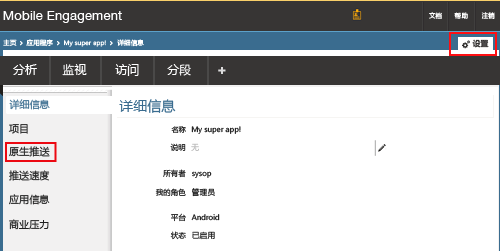
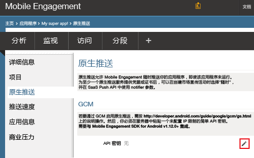
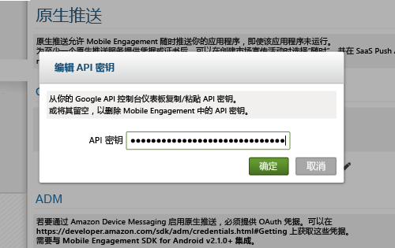
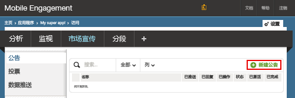
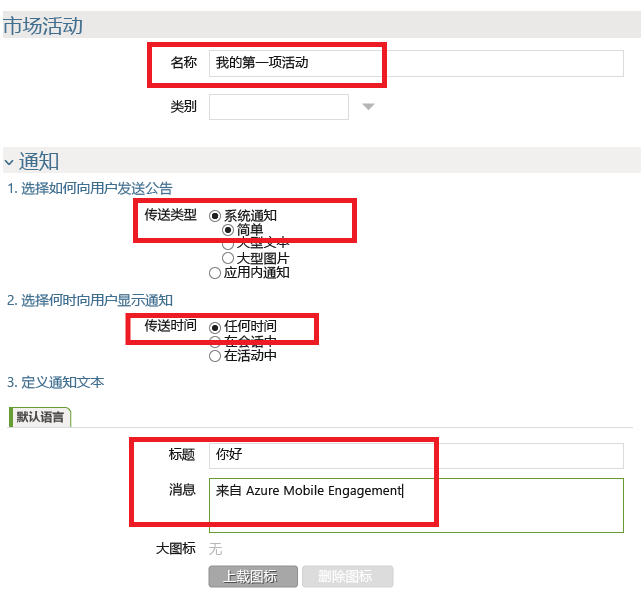
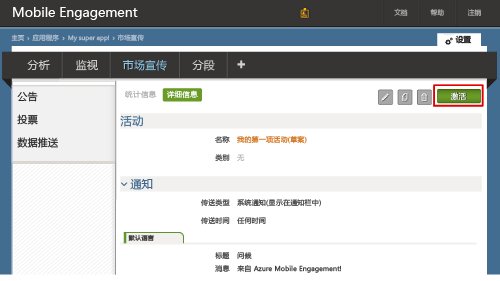

###将 Mobile Engagement 访问权限授予 GCM API 密钥

若要允许 Mobile Engagement 代表用户发送推送通知，需授予其访问 API 密钥的权限。通过配置并将用户密钥输入 Mobile Engagement 门户中，即可完成授权。

1. 从 Azure 经典门户中，确保进入用于本项目的应用中，然后单击底部的“参与”按钮：

	

2. 然后依次单击“设置”>“原生推送”部分即可输入 GCM 密钥：

	

3. 在“GCM 设置”部分中，单击“API 密钥”前面的“编辑”图标，如下所示：

	

4. 在弹出窗口中，粘贴之前获取的 GCM 服务器密钥，然后单击“确定”。

	

##向应用发送通知

我们现在创建一个简易的推送通知市场活动，将推送通知发送到应用。

1. 导航到 Mobile Engagement 门户中的“市场宣传”选项卡。

2. 单击“新建公告”创建推送通知市场活动。

	

3. 通过以下步骤设置市场活动的第一个字段：

	

	a.为市场活动命名。

	b.选择“系统通知 -> 简易”作为“传递类型”：这是简易的 Android 推送通知类型，有一个标题和一小行文本。

	c.选择“随时”作为“传递时间”，允许应用随时接收通知，无论应用是否已启动。

	d.在通知文本中键入“标题”（在推送中以粗体显示）。

	e.然后键入“消息”

4. 向下滚动，在“内容”部分中选择“仅通知”。

	

5. 已设置完可能情况下最基本的市场活动。现在再次向下滚动，然后单击“创建”按钮保存市场活动。

6. 最后一步：单击“激活”激活市场活动，发送推送通知。

	

<!---HONumber=AcomDC_0921_2016-->