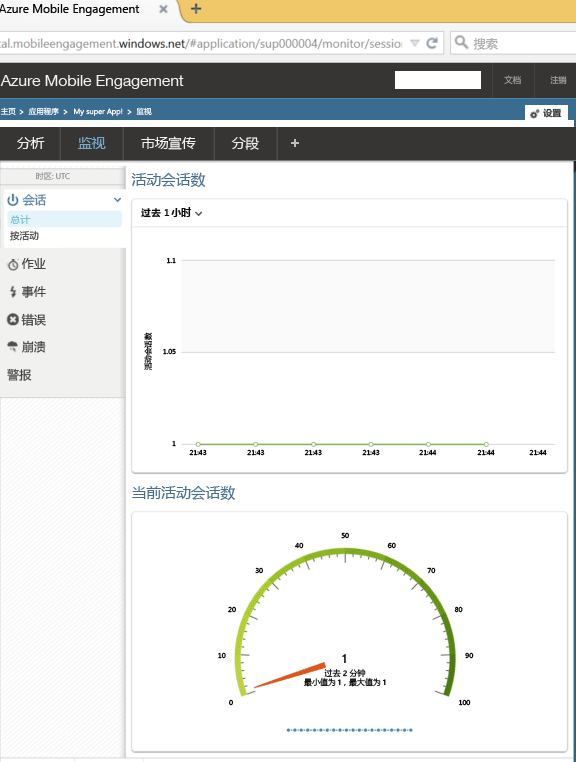

本部分介绍如何使用 Mobile Engagement 的实时监控功能，将应用连接到 Mobile Engagement 后端。 

1. 在 **Azure Mobile Engagement** 帐户中，请确保选择要在 **Mobile Engagement** 门户中进行监视和管理的应用。 单击底部的“参与”  按钮，导航到 Mobile Engagement 门户。 
   
     
2. 将进入 Mobile Engagement 门户。 如果未选择“监视器”选项卡，请单击“监视器” 。
3. 此监视器可实时向你显示将启动应用的任何设备。
4. 立即启动应用。 如果集成正确，也就是说应用现在已连接到 Mobile Engagement 后端，并且正在向它发送数据，应该可以在监视器中看到一个会话。  
   
     

