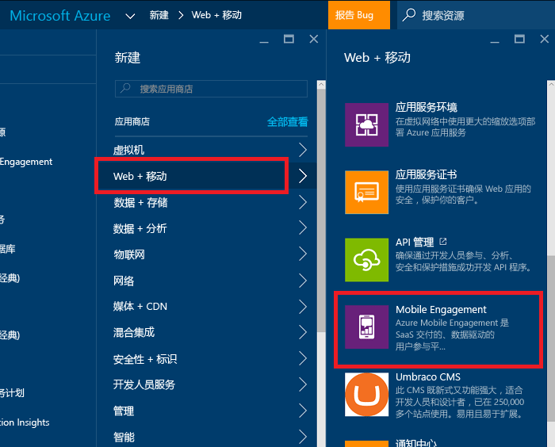
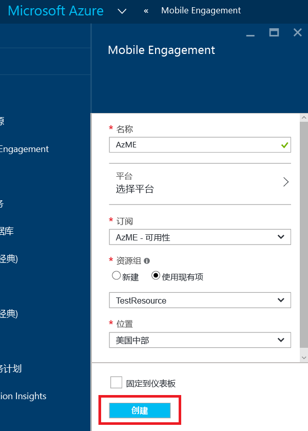
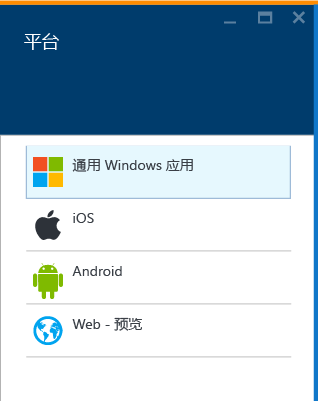
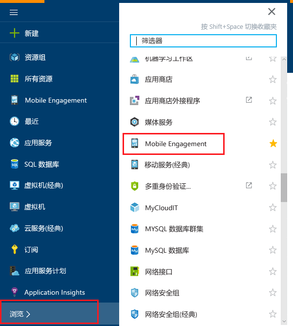
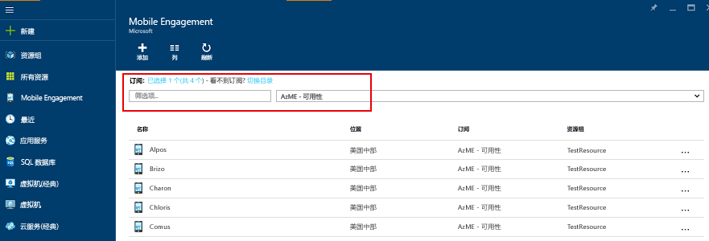
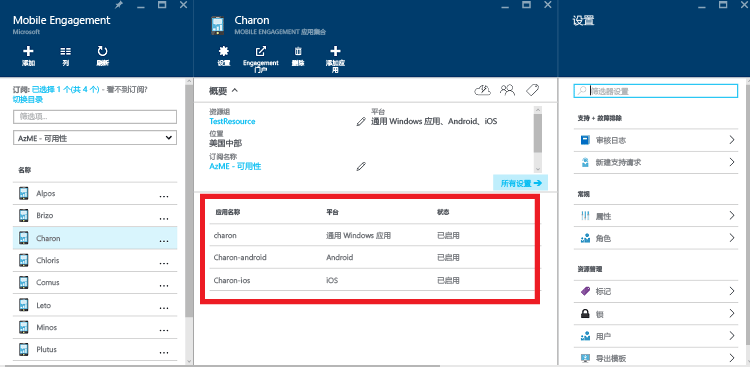
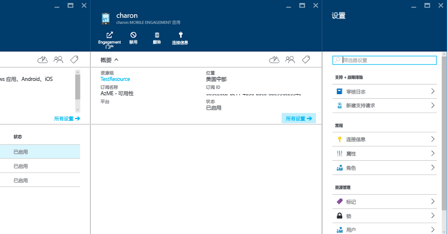
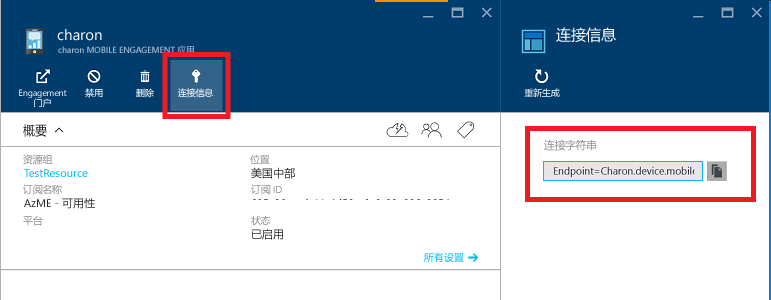

1. 登录到 [Azure 门户](https://portal.azure.com)。

2. 依次单击“新建”、“Web + 移动”和“Mobile Engagement”。

   	

3. 在显示的“新 Mobile Engagement 应用集合”边栏选项卡中，将要创建的是一个应用集合，而不是创建类似于 Azure 经典门户中的某个应用。输入以下信息：

   	

	- **名称**：*应用程序集合*的名称
	- **平台**：在将要打开的“平台”边栏选项卡上选择适用于应用的目标平台。例如，如果想要应用同时适用于 iOS 和 Android，请同时选择这两个平台，即可获得两个在此应用集合下创建的应用。

   	

	- **订阅**：选择 Azure 订阅。
	- **资源组**：选择要将此 Azure 资源放入其中的 Azure 资源组（Mobile Engagement 应用集合）。可以选择创建新资源组。
	- **位置**：有关此应用集合和应用的数据将要存储的区域。

5. 单击“浏览”浏览 Mobile Engagement 应用集合，并搜索“Mobile Engagement”

	

6. 将看到一系列 Mobile Engagement 应用集合 - 请确保在创建应用集合的位置中拥有相同的 Azure 订阅。

	

7. 单击在之前步骤中创建的应用集合，打开“应用集合资源”边栏选项卡，即可看到此应用集合中存在许多不同的应用。

	

8. 单击为正在针对其开发的平台创建的应用。

	

9. 单击顶部的“连接信息”命令按钮，打开“连接信息”边栏选项卡，并从中复制连接字符串。

	

<!---HONumber=AcomDC_0921_2016-->