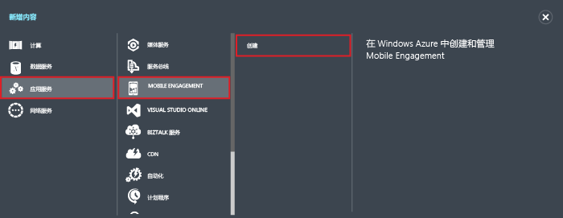

1. 登录到 [Azure 经典门户](https://manage.windowsazure.com)，然后单击屏幕底部的“+新建”。
2. 依次单击“应用服务”、“Mobile Engagement”、“创建”。
   
       
3. 在显示的弹出窗口中，输入以下信息：
   
       
   
   * **应用程序名称**：应用程序的名称。 
   * **平台**：适用于应用的目标平台。 必须为要面向移动应用程序的每个平台都创建一个 Mobile Engagement 应用。 
   * **应用程序资源名称**：可通过 API 和 URL 访问此应用程序的资源名称。 
   * **位置**：将托管此应用和应用集合所在的区域/数据中心。
   * **集合**：选择之前创建的集合或选择“新建集合”。
   * **集合名称**：表示应用程序组。 这将确保所有应用都在一个组中，从而允许聚合计算指标。 应在此处使用公司名称或部门名称（如果适用）。
4. 选择刚刚在“应用程序”  选项卡中创建的应用。
5. 单击“连接信息”  ，显示连接设置，以便在移动应用中与 SDK 集成。
6. 复制“连接字符串”  - 需要使用此字符串在应用程序代码中识别此应用，并通过应用与 Mobile Engagement 进行连接。
   
       

<!--HONumber=Jan17_HO3-->

