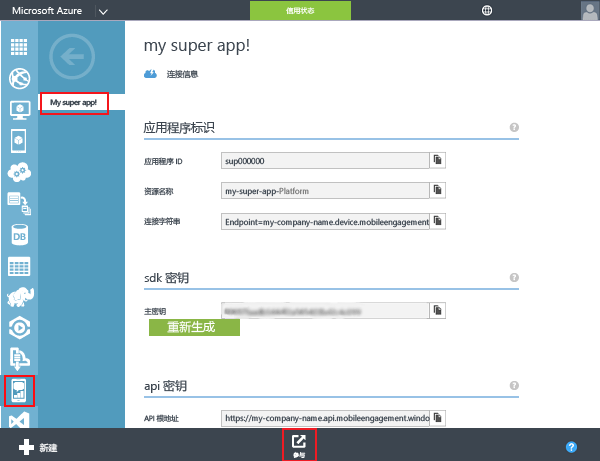
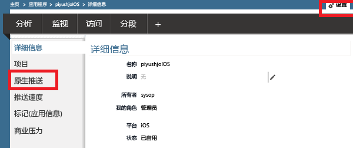
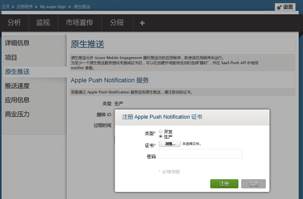
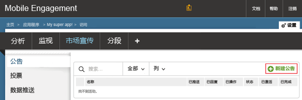
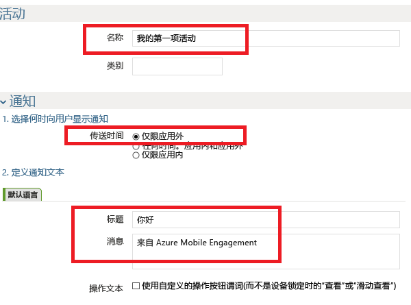
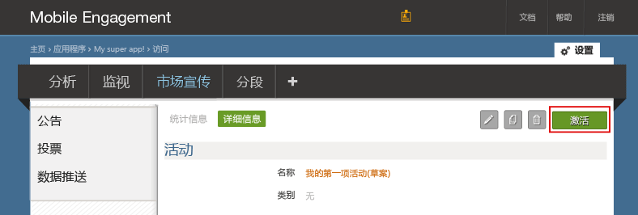
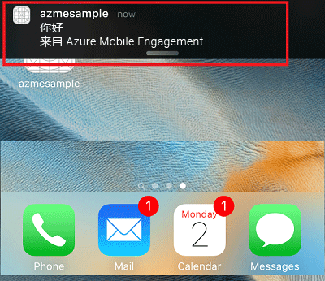
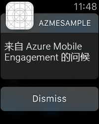

### 为推送到 Mobile Engagement 证书授予访问权限
若要允许 Mobile Engagement 替你发送推送通知，你需要授予它对你的证书访问。 这可通过配置和 Mobile Engagement 门户中输入你的证书。 请确保你获取.p12 证书中所述[Apple 的文档](https://developer.apple.com/library/prerelease/ios/documentation/IDEs/Conceptual/AppDistributionGuide/AddingCapabilities/AddingCapabilities.html#//apple_ref/doc/uid/TP40012582-CH26-SW6)

1. 导航到你的 Mobile Engagement 门户。 确保你正在使用正确的然后单击**接洽**底部的按钮：
   
    
2. 单击**设置**Engagement 门户中的页。 从在该处单击**原生推送**部分上载你 p12 证书：
   
    
3. 选择你 p12，将其上载，然后键入你的密码：
   
    

## 将通知发送到你的应用程序
我们现在将创建一个简单的推送通知活动中，将向我们的应用程序发送推送：

1. 导航到**到达**Mobile Engagement 门户中的选项卡。
2. 单击**新公告**创建你的推送活动
   
    
3. 安装你的活动的第一个字段：
   
    
   
   * 提供**名称**为你的市场活动 
   * 选择**传递时间**作为**仅应用程序外**： 这是 Apple 推送通知的简单类型功能一些文本。
   * 在通知文本中，先键入**标题**将推送的第一行。
   * 然后键入你**消息**将第二行
4. 向滚动关闭，并在内容部分选择**仅通知**
   
    
5. 已完成设置最基本的营销活动。 现在向下滚动并单击**创建**按钮以保存你的推送通知活动。 
6. 最后-单击**激活**发送推送通知。 
   
    
7. 您将可以在如下所示的通知中心中接收有关你的 iOS 设备的通知：
   
    
8. 如果你有与此 iOS 设备配对 Apple Watch 然后你将在 Apple Watch 上看到通知：
   
    

