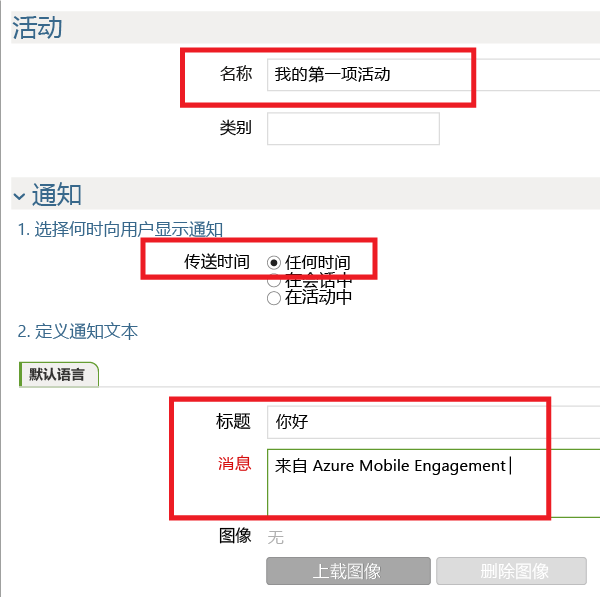
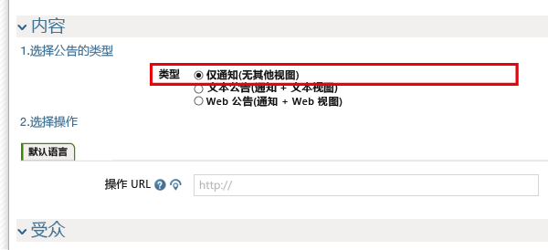
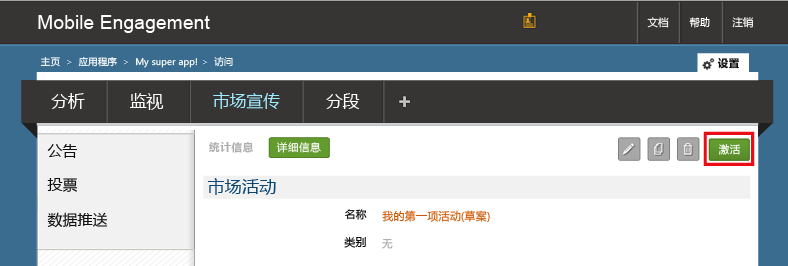

我们现在创建一个简易的推送通知市场活动，将推送通知发送到应用。

1. 导航到 Mobile Engagement 门户中的“市场宣传”选项卡。

2. 单击“新建公告”创建推送通知市场活动。

	

3. 通过以下步骤设置市场活动的第一个字段：

	

	a.为市场活动提供**名称**。

	b.选择“任何时间”作为“传递时间”。

	d.在通知文本中键入“标题”（在推送中以粗体显示）。

	e.然后键入“消息”

4. 向下滚动，然后在“内容”部分中选择“仅通知”。

	

5. 已设置完可能情况下最基本的市场活动。现在再次向下滚动，然后单击“创建”按钮保存市场活动。

6. 最后一步：单击“激活”激活市场活动，并发送推送通知。

	

 

<!---HONumber=AcomDC_0921_2016-->