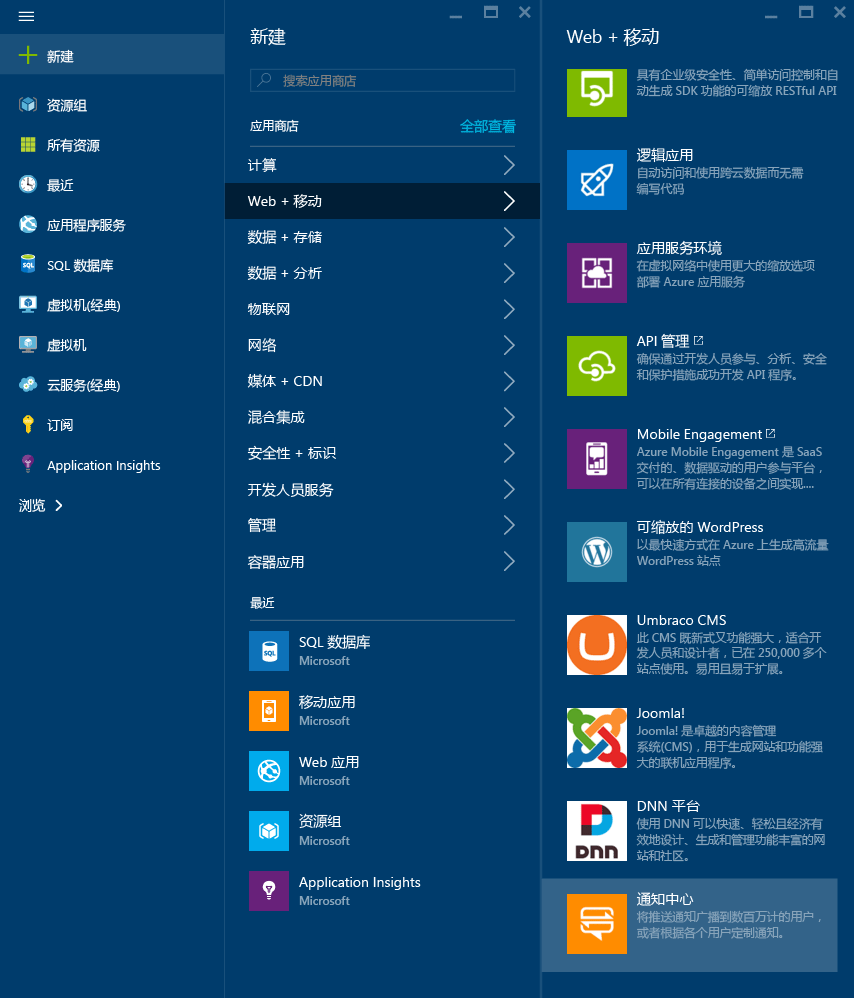
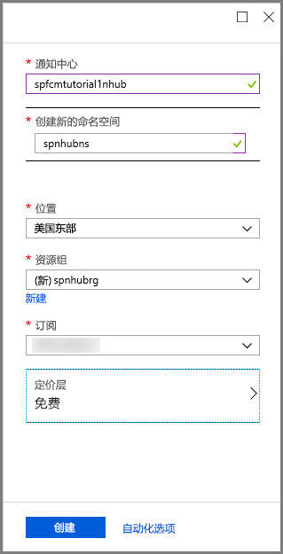
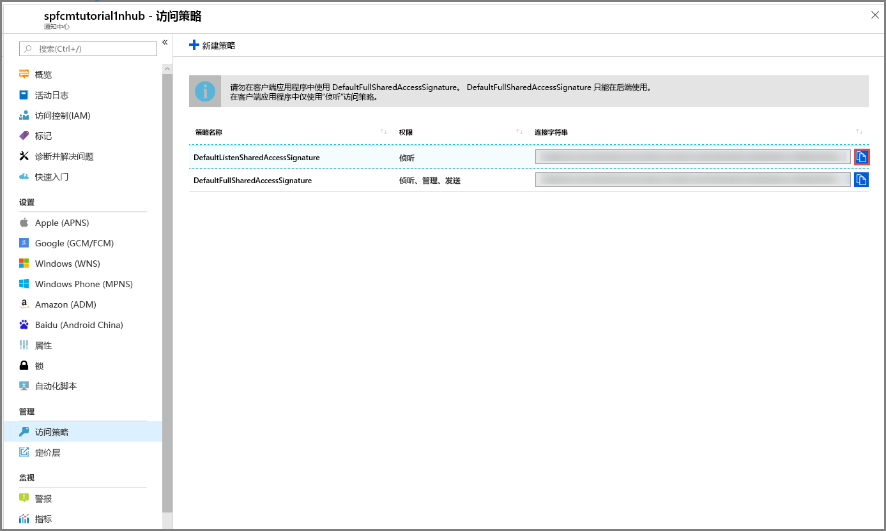

1. 登录到 [Azure 门户](https://portal.azure.com)。

2. 选择“创建资源” > “移动” > “通知中心”。
   
      
      
3. 在“通知中心”框中，键入一个唯一名称。 选择“区域”、“订阅”和“资源组”（如果已经有一个）。 
   
      如果尚无服务总线命名空间，可以使用基于中心名称创建的默认名称（如果该命名空间名称可用）。
    
      如果已有要在其中创建中心的服务总线命名空间，请执行以步骤

    a. 在“命名空间”区域中，选择“选择现有”链接。 
   
    b. 选择**创建**。
   
      

4. 选择“通知”（钟形图标），然后选择“转到资源”。 

          
5. 从列表中选择“访问策略”。 记下向你提供的两个连接字符串。 稍后在处理推送通知时需要它们。

      >[!IMPORTANT]
      >请**勿**在应用程序中使用 DefaultFullSharedAccessSignature。 这只能在后端使用。
      >
   
      

