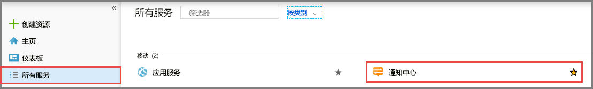
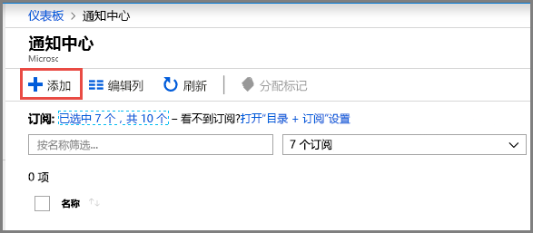
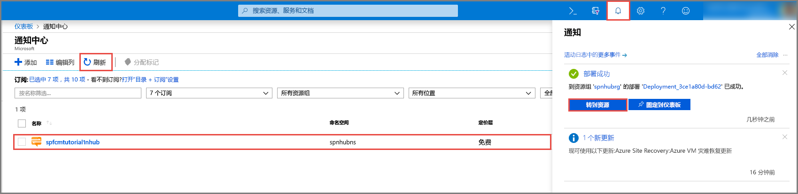

1. 登录到 [Azure 门户](https://portal.azure.com)。
2. 在左侧菜单上选择“所有服务”，然后在“移动”部分中选择“通知中心”。 选择服务名称旁边的星星 (`*`) 以将其添加到左侧菜单上的“收藏夹”部分。 在将“通知中心”添加到“收藏夹”之后，在菜单上选择它。 

      
3. 在“通知中心”页面上，在工具栏上选择“添加”。 

      
4. 在“通知中心”页面上，执行以下步骤： 
    1. 为通知中心指定一个名称。  
    2. 为命名空间指定一个名称。 命名空间包含一个或多个中心。 
    3. 选择要在其中创建通知中心的位置。 
    4. 选择一个现有资源组，或者为新资源组输入一个名称。
    5. 选择“创建”。 

        
4. 选择“通知”（钟形图标），然后选择“转到资源”。 还可以刷新“通知中心”页中的列表，然后选择通知中心。 

      
5. 从列表中选择“访问策略”。 记下向你提供的两个连接字符串。 稍后在处理推送通知时需要它们。

      >[!IMPORTANT]
      >请**勿**在应用程序中使用 DefaultFullSharedAccessSignature。 这只能在后端使用。
      >

      
