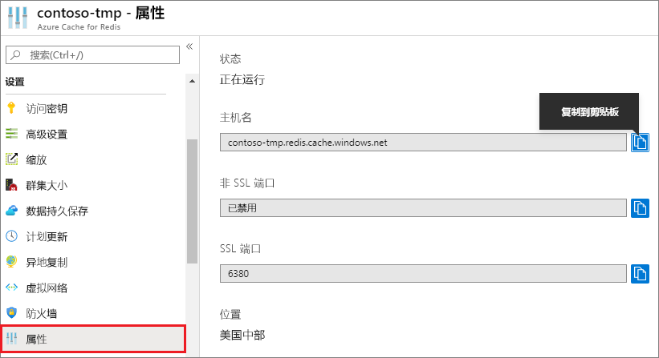

### 使用 Azure 门户检索主机名、端口和访问密钥

连接到某个 Azure Redis 缓存实例时，缓存客户端需要该缓存的主机名、端口和密钥。 在某些客户端中，这些项的名称可能略有不同。 可以在 Azure 门户中检索此信息。

若要使用 [Azure 门户](https://portal.azure.com)检索访问密钥，请浏览到缓存，然后单击“访问密钥”。 

若要检索主机名、端口，请单击“属性”。

