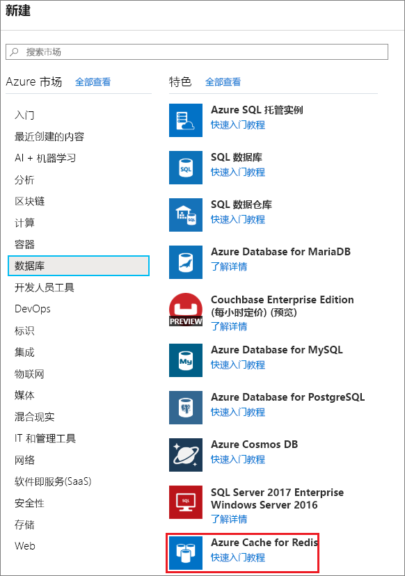
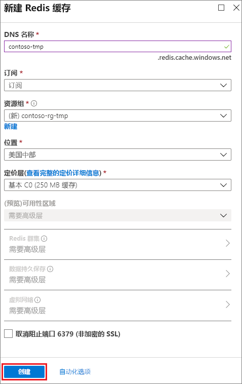
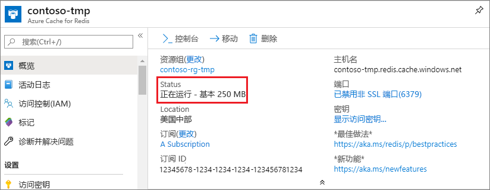

若要创建缓存，首先请登录到 [Azure 门户](https://portal.azure.com)，然后单击“新建”、“数据 + 存储”、“Redis 缓存”。

> [!NOTE]
> 如果你没有 Azure 帐户，只需花费几分钟就能 [免费建立一个 Azure 帐户](https://azure.microsoft.com/pricing/free-trial/?WT.mc_id=redis_cache_hero) 。
> 
> 

> [!NOTE]
> 除了在 Azure 门户中创建缓存以外，也可以使用 Resource Manager 模板、PowerShell 或 Azure CLI 创建。
> 
> * 若要使用 Resource Manager 模板创建缓存，请参阅 [使用模板创建 Redis 缓存](../articles/redis-cache/cache-redis-cache-arm-provision.md)。
> * 若要使用 Azure PowerShell 创建缓存，请参阅 [Manage Azure Redis Cache with Azure PowerShell](../articles/redis-cache/cache-howto-manage-redis-cache-powershell.md)（使用 Azure PowerShell 管理 Azure Redis 缓存）。
> * 若要使用 Azure CLI 创建缓存，请参阅 [How to create and manage Azure Redis Cache using the Azure Command-Line Interface (Azure CLI)](../articles/redis-cache/cache-manage-cli.md)（如何使用 Azure 命令行接口 (Azure CLI) 创建和管理 Azure Redis 缓存）。
> 
> 

在“新建 Redis 缓存”边栏选项卡中，指定所需的缓存配置  。

 

* 在“DNS 名称”中，输入用于缓存终结点的缓存名称。 `-` 字符。 缓存名称的开头或末尾不能是 `-` 字符，并且连续的 `-` 字符无效。
* 对于“订阅”，请选择需要用于缓存的 Azure 订阅。 如果帐户只有一个订阅，将自动选择该订阅并且不显示“订阅”下拉菜单。
* 在“资源组” 中，为缓存选择或创建资源组。 有关详细信息，请参阅[使用资源组管理 Azure 资源](../articles/azure-resource-manager/resource-group-overview.md)。 
* 使用“位置”指定在其中托管你的缓存的地理位置  。 Microsoft 强烈推荐的最佳做法，是在与缓存客户端应用程序相同的区域中创建缓存。
* 使用“定价层”  选择所需的缓存大小和功能。
* **Redis 群集** 允许你创建大于 53 GB 的缓存，以及将数据分散到多个 Redis 节点。 有关详细信息，请参阅 [如何为高级 Azure Redis 缓存配置群集功能](../articles/redis-cache/cache-how-to-premium-clustering.md)。
* **Redis 持久性** 可让你将缓存保存到 Azure 存储帐户。 有关配置暂留的说明，请参阅 [《How to configure persistence for a Premium Azure Redis Cache》](../articles/redis-cache/cache-how-to-premium-persistence.md)（如何为高级 Azure Redis 缓存配置暂留）。
* **虚拟网络** 通过将缓存访问权限限制于指定的 Azure 虚拟网络内的客户端，提供增强的安全性和隔离度。 可以使用 VNet 的所有功能，例如子网、访问控制策略和其他功能，进一步限制对 Redis 的访问。 有关详细信息，请参阅 [如何为高级 Azure Redis 缓存配置虚拟网络支持](../articles/redis-cache/cache-how-to-premium-vnet.md)。

在配置了新的缓存选项后，单击“创建” 。 创建缓存可能耗时几分钟。 要检查的状态，可以监视开始板上的进度。 创建缓存后，新缓存的状态为“正在运行”  并且随时可与 [默认设置](../articles/redis-cache/cache-configure.md#default-redis-server-configuration)搭配使用。

<!--HONumber=Jan17_HO1-->

