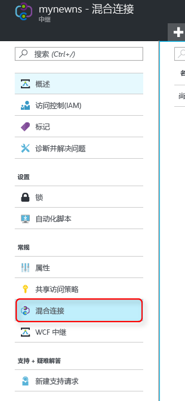
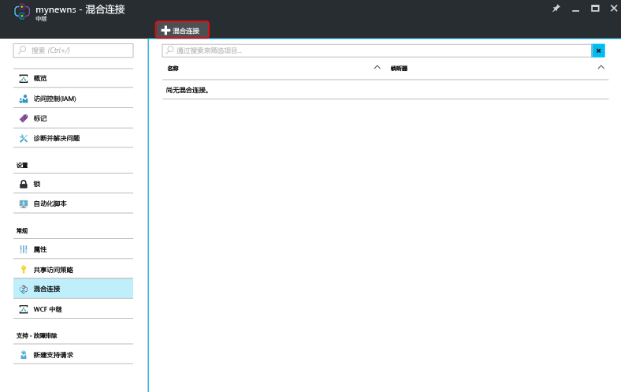
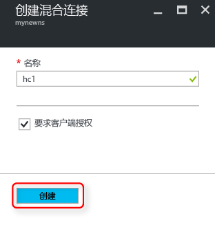

确保已创建中继命名空间，如[此处][namespace-how-to]所示。

1. 登录到 [Azure 门户](https://portal.azure.com)。
2. 在门户的左侧导航窗格中，单击“中继”。
3. 选择要在其中创建混合连接的命名空间。 在本示例中，该命名空间为 **mynewns**。
   
    
4. 在“中继命名空间”边栏选项卡中，选择“混合连接”，然后单击“+ 混合连接”。
   
    
5. 输入**混合连接名称**，其他值保留默认值。
   
    
6. 单击边栏选项卡底部的“创建” 。

[namespace-how-to]: ../articles/service-bus-relay/relay-create-namespace-portal.md 