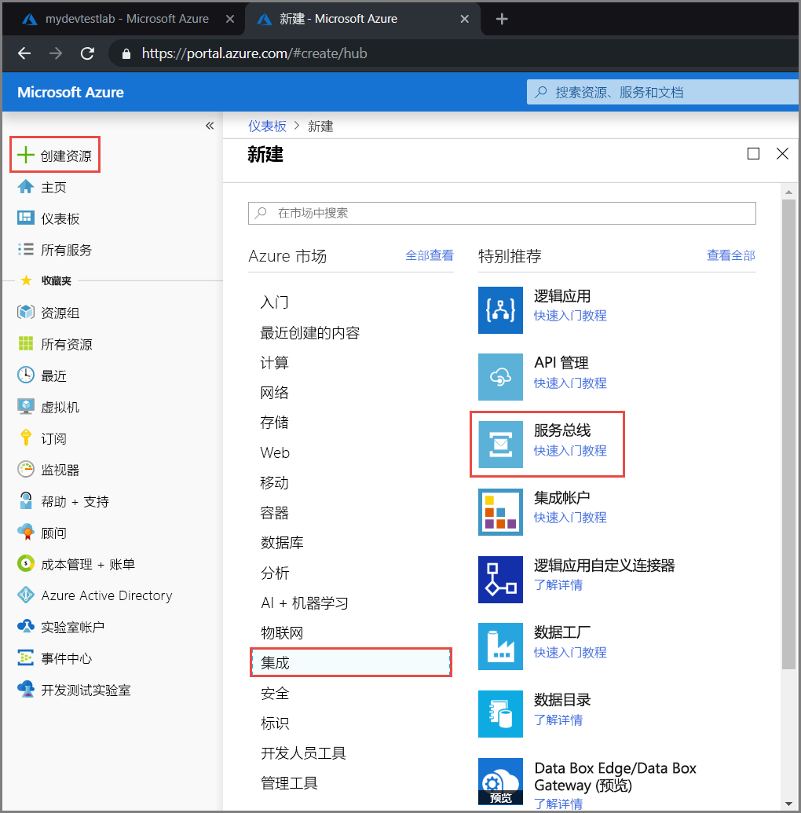
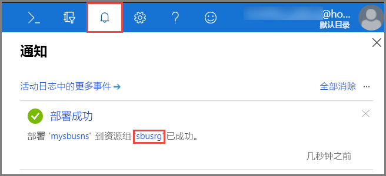
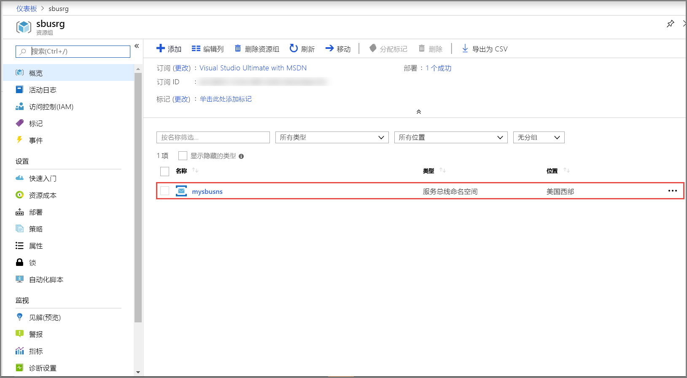
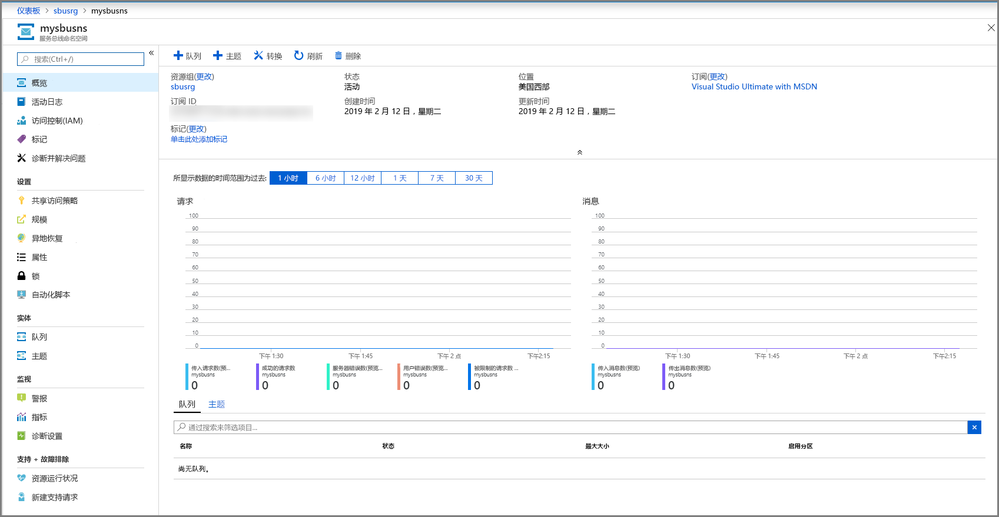
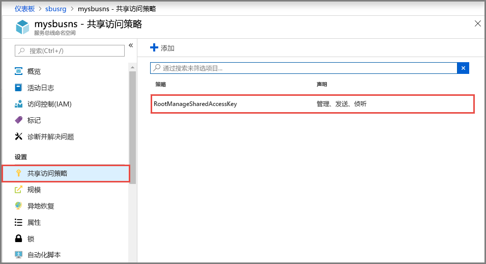
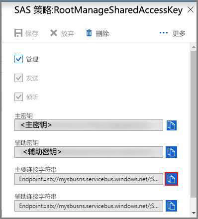

## 在 Azure 门户中创建命名空间
若要开始在 Azure 中使用服务总线消息实体，必须先使用在 Azure 中唯一的名称创建一个命名空间。 命名空间提供了用于对应用程序中的 Service Bus 资源进行寻址的范围容器。

创建命名空间：

1. 登录到 [Azure 门户](https://portal.azure.com)
2. 在门户的左侧导航窗格中，依次选择“+ 创建资源”、“集成”、“服务总线”    。

    
3. 在“创建命名空间”对话框中执行以下步骤  ： 
    1. 输入**命名空间的名称**。 系统会立即检查该名称是否可用。 若需用于对命名空间进行命名的规则的列表，请参阅[创建命名空间 REST API](/rest/api/servicebus/create-namespace)。
    2. 选择命名空间的定价层（“基本”、“标准”或“高级”）。 若要使用[主题和订阅](../articles/service-bus-messaging/service-bus-queues-topics-subscriptions.md#topics-and-subscriptions)，请选择“标准”或“高级”。 基本定价层中不支持主题/订阅。
    3. 如果选择了“高级”定价层，请执行以下步骤：  
        1. 指定**消息传送单元**的数目。 高级层在 CPU 和内存级别提供资源隔离，使每个工作负荷在隔离的环境中运行。 此资源容器称为消息传送单元。 高级命名空间至少具有一个消息传送单元。 可为每个服务总线高级命名空间选择 1、2 或 4 个消息传送单元。 有关详细信息，请参阅[服务总线高级消息传送](../articles/service-bus-messaging/service-bus-premium-messaging.md)。
        2. 指定是否要将命名空间设为**区域冗余**。 区域冗余通过在一个区域中的所有可用性区域之间分散副本来提供增强的可用性。 有关详细信息，请参阅 [Azure 中的可用性区域](../articles/availability-zones/az-overview.md)。
    4. 对于“订阅”，请选择要在其中创建命名空间的 Azure 订阅。 
    5. 对于“资源组”，请选择该命名空间驻留到的现有资源组，或创建一个新资源组。       
    6. 对于“位置”，请选择托管该命名空间的区域。 
    7. 选择“创建”  。 系统现已创建命名空间并已将其启用。 可能需要等待几分钟，因为系统将为帐户配置资源。
   
        
4. 确认是否已成功部署服务总线命名空间。 若要查看通知，请在工具栏上选择**钟形图标（警报）** 。 如下图所示，在通知中选择**资源组的名称**。 将会看到包含服务总线命名空间的资源组。

    
5. 在资源组的“资源组”页上，选择你的**服务总线命名空间**。  

    
6. 将会看到服务总线命名空间的主页。 

    

## 获取连接字符串 
创建新的命名空间时，会自动生成一项初始的共享访问签名 (SAS) 规则，将一对主密钥和辅助密钥关联到一起，向每个密钥授予对命名空间的所有资产的完全控制权限。 请参阅[服务总线身份验证和授权](../articles/service-bus-messaging/service-bus-authentication-and-authorization.md)，了解如何创建规则来对普通发送者和接收者的权限进行更多限制。 若要复制命名空间的主要密钥和辅助密钥，请执行以下步骤： 

1. 单击“所有资源”，然后单击新创建的命名空间名称。 
2. 在命名空间窗口中，单击“共享访问策略”  。
3. 在“共享访问策略”  屏幕中，单击“RootManageSharedAccessKey”  。
   
    
4. 在“策略:  RootManageSharedAccessKey”窗口中，单击“主连接字符串”旁边的复制按钮，将连接字符串复制到剪贴板供稍后使用  。 将此值粘贴到记事本或其他某个临时位置。
   
    
5. 重复上述步骤，将**主键**的值复制和粘贴到临时位置，以供将来使用。

<!--Image references-->

