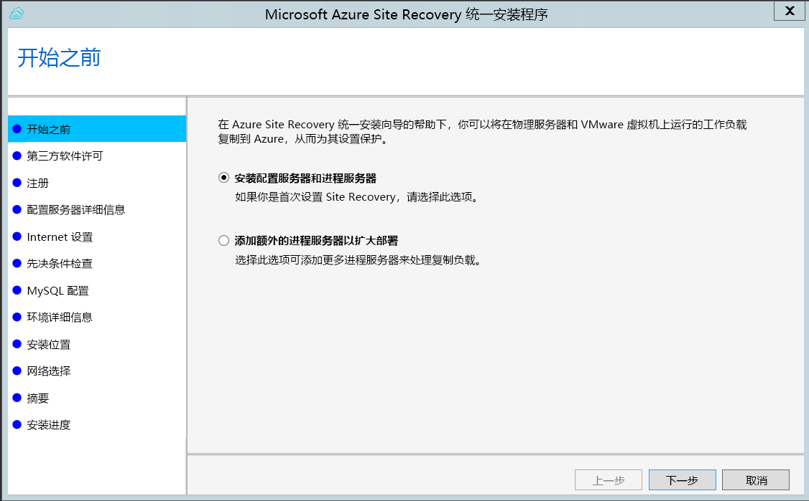
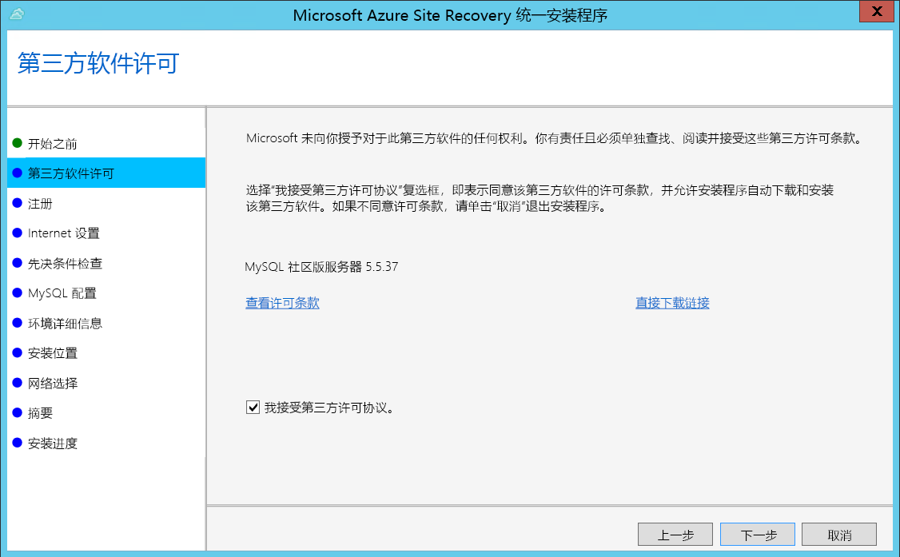
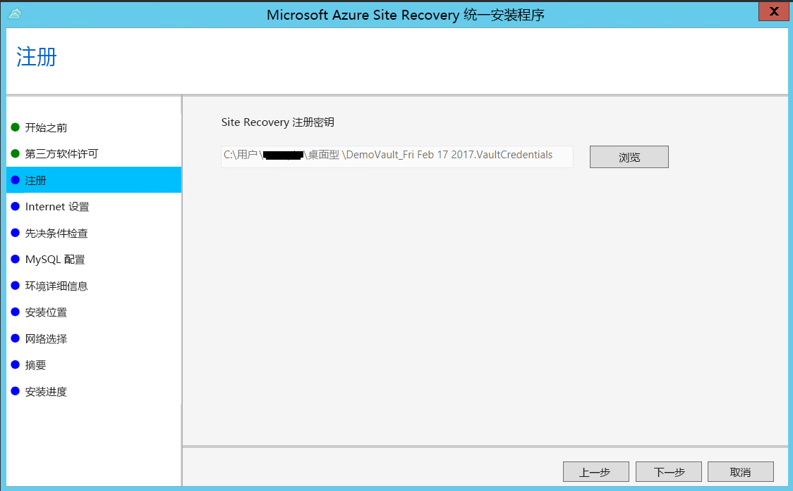
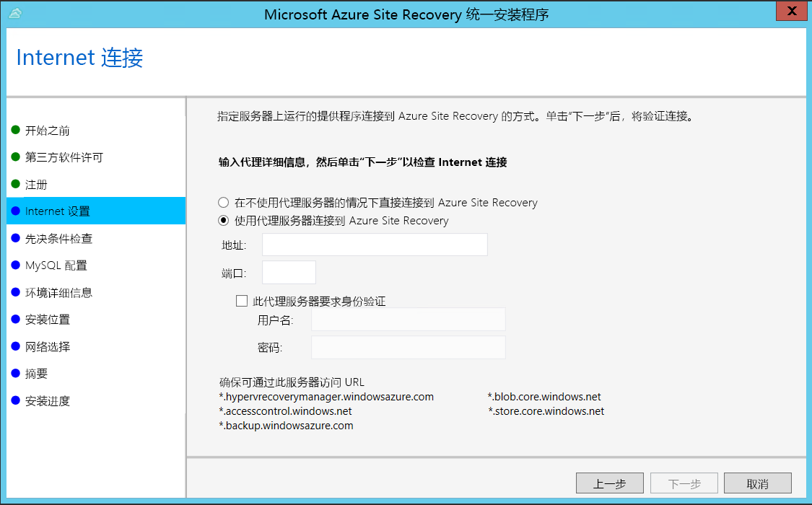
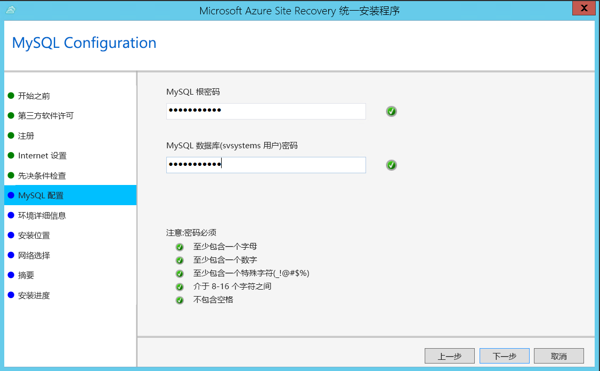
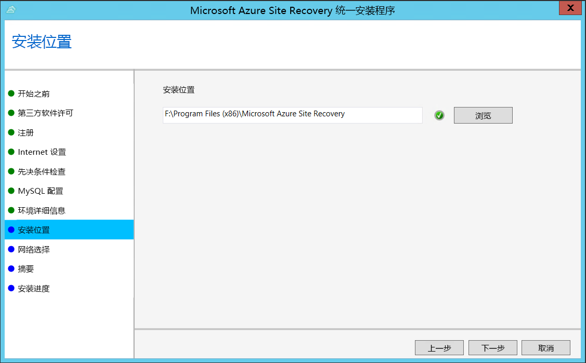
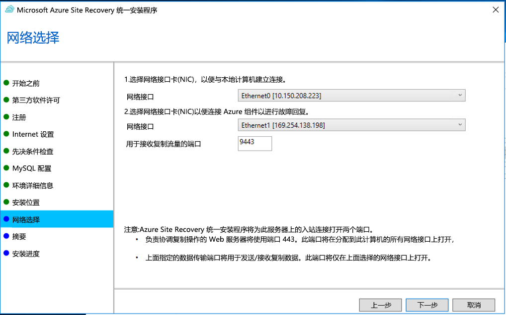
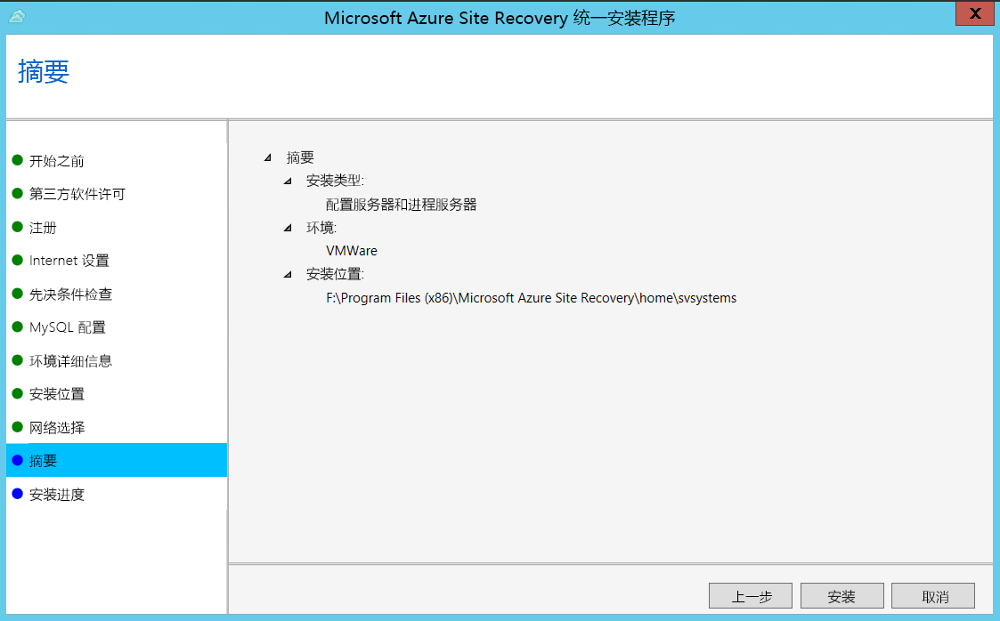

1. 运行统一安装程序安装文件。
2. 在“开始之前”中，选择“安装配置服务器和进程服务器”。

    

3. 在“第三方软件许可证”中单击“我接受”，下载并安装 MySQL。

    
4. 在“注册”中，选择从保管库下载的注册密钥。

    
5. 在“Internet 设置”中，指定配置服务器上运行的提供程序如何通过 Internet 连接到 Azure Site Recovery。 确保已允许所需的 URL。

    - 如果想要使用当前已在计算机上设置的代理进行连接，请选择“使用代理服务器连接到 Azure Site Recovery”。
    - 如果希望提供程序直接进行连接，请选择“在不使用代理服务器的情况下直接连接到 Azure Site Recovery”。
    - 如果现有代理要求身份验证，或者你想要使用自定义代理进行提供程序连接，请选择“使用自定义代理设置进行连接”，并指定地址、端口和凭据。
     
6. 在“先决条件检查”设置中运行检查，确保安装可以运行。 如果看到有关**全局时间同步检查**的警告，请检查系统时钟的时间（“日期和时间”设置）是否与时区相同。

    
7. 在“MySQL 配置”中，创建用于登录到要安装的 MySQL 服务器实例的凭据。

    
8. 在“环境详细信息”中，如果要复制 Azure Stack VM 或物理服务器，请选择“否”。 
9. 在“安装位置”中，选择要安装二进制文件和存储缓存的位置。 所选驱动器必须至少有 5 GB 的可用磁盘空间，但我们建议选择至少有 600 GB 可用空间的缓存驱动器。

    
10. 在“网络选择”中，指定侦听器（网络适配器和 SSL 端口），以便配置服务器在其上发送和接收复制数据。 端口 9443 是用于发送和接收复制流量的默认端口，但可以根据环境的要求修改此端口号。 除了端口 9443 以外，还要打开端口 443，Web 服务器将使用该端口协调复制操作。 请不要使用端口 443 来发送或接收复制流量。

    

11. 在“摘要”中复查信息，并单击“安装”。 安装完成后，将生成通行短语。 启用复制时需要用到它，因此请复制并将它保存在安全的位置。

    

注册完成后，服务器会显示在保管库的“设置” > “服务器”边栏选项卡中。
