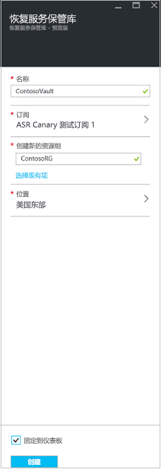

1. 登录到 [Azure 门户](https://portal.azure.com) > “Site Recovery”。
2. 单击“新建” > “监视和管理” > “备份和 Site Recovery”。 
3. 在“名称”中，指定一个友好名称以标识该保管库。 如果你有多个订阅，请选择其中一个。
4. [创建一个资源组](../articles/azure-resource-manager/resource-group-template-deploy-portal.md)或选择现有的资源组。 指定 Azure 区域。 若要查看受支持的区域，请参阅 [Azure Site Recovery 定价详细信息](https://azure.microsoft.com/pricing/details/site-recovery/)中的“地域可用性”。
5. 若要从仪表板快速访问保管库，请单击“固定到仪表板”，然后单击“创建”。

   

   新保管库将显示在“仪表板” > “所有资源”中，以及“恢复服务保管库”主边栏选项卡上。
