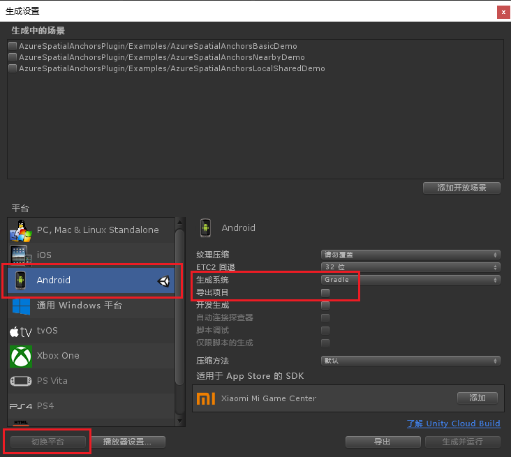

通过选择“文件” > “生成设置”，打开“生成设置”。

在“平台”部分，选择“Android”。 将“生成系统”更改为“Gradle”，并选择“导出项目”。

选择“切换平台”，以将平台更改为“Android”。 Unity 可能会提示你安装 Android 支持组件（若缺少这些组件）。

关闭“生成设置”窗口。

### 下载并导入适用于 Unity 的 SDK

从[适用于 Unity 1.7 版本的 ARCore SDK](https://github.com/google-ar/arcore-unity-sdk/releases/tag/v1.7.0) 下载 `unitypackage` 文件。 返回 Unity 项目，选择“资产” > “导入包” > “自定义包”，然后选择之前下载的 `unitypackage` 文件。 在“导入 Unity 包”对话框中，确保选中所有文件，然后选择“导入”。
