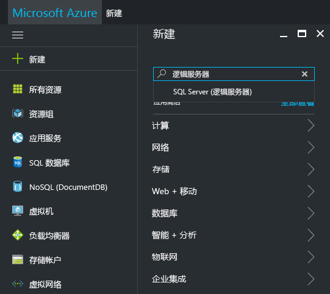
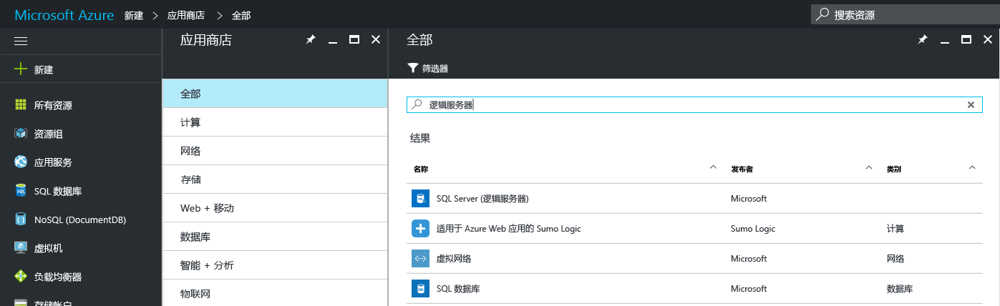
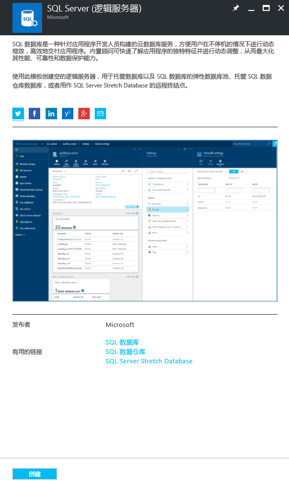
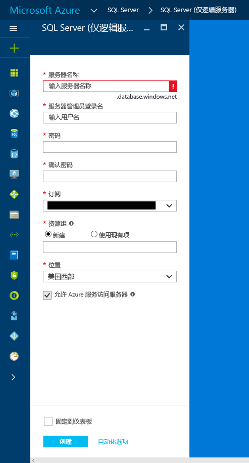
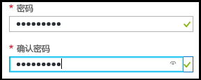

### 在 Azure 门户中创建新的 SQL 逻辑服务器

1. 单击“新建”，搜索“逻辑服务器”，并按 **ENTER**。

    
2. 选择“SQL 服务器(逻辑服务器)”。 

    
  
3. 单击“创建”打开“新建 SQL 服务器(逻辑服务器)”边栏选项卡。

   <kbd></kbd><kbd></kbd>
  
3. 在“SQL 服务器(逻辑服务器)”边栏选项卡的服务器名称文本框中，提供新逻辑服务器的有效名称。 绿色的对勾表示已提供有效名称。
    
    

    > [!IMPORTANT]
    > 新服务器的完全限定名称为 <服务器名称>.database.windows.net。
    >
    
4. 在“服务器管理员登录名”文本框中，提供此服务器的 SQL 身份验证登录名的用户名。 此登录名称为服务器主体登录名。 绿色的对勾表示已提供有效名称。
    
    
5. 在“密码”和“确认密码”文本框中，提供服务器主体登录帐户的密码。 绿色复选标记表示提供的密码有效。
    
    
6. 选择一个有权在其中创建对象的订阅。

    
7. 在“资源组”文本框中选择“新建”，并在“资源组”文本框中提供新资源组的有效名称（如果已自行创建了一个资源组，则也可以使用该资源组）。 绿色的对勾表示已提供有效名称。

    

8. 在“位置”文本框中，选择适合所在位置的数据中心，如“澳大利亚东部”。
    
    
    
    > [!TIP]
    > 无法在此边栏选项卡中更改“允许 Azure 服务访问服务器”复选框的状态。 可以在服务器防火墙边栏选项卡中更改此设置。 有关详细信息，请参阅 [Get started with security](../articles/sql-database/sql-database-manage-servers-portal.md)（安全性入门）。
    >
    
9. 单击“创建” 。

    

