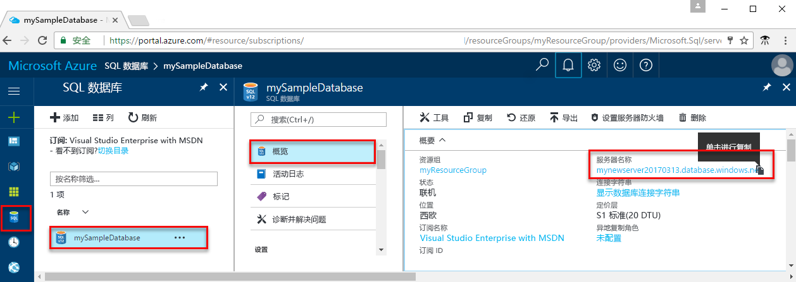

<!-- sql-database-connect-query-prerequisites-server-connection-info-includes.md 

## SQL server connection information
-->

获取连接到 Azure SQL 数据库所需的连接信息。 在后续过程中，将需要完全限定的服务器名称、数据库名称和登录信息。

1. 登录到 [Azure 门户](https://portal.azure.com/)。
2. 从左侧菜单中选择“SQL 数据库”，并单击“SQL 数据库”页上的数据库。 
3. 在数据库的“概览”页上，查看如下图所示的完全限定的服务器名称。 可以将鼠标悬停在服务器名称上以打开“单击以复制”选项。  

    

4. 如果忘了服务器的登录信息，请导航到 SQL 数据库服务器页，以查看服务器管理员名称。 如有必要，请重置密码。

