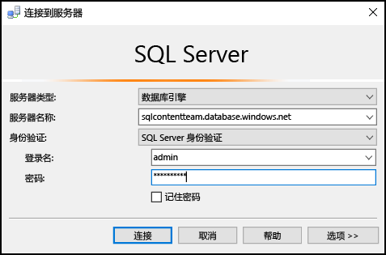
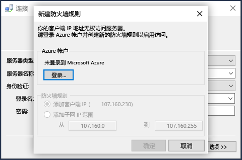
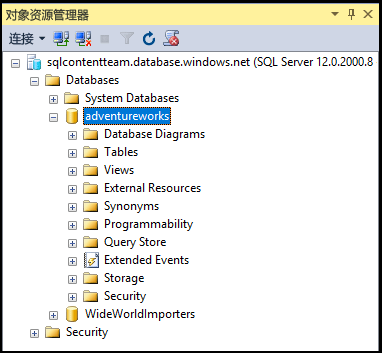

## 使用 SQL Server 身份验证连接到 Azure SQL 数据库
以下步骤演示如何使用 SSMS 连接到 Azure SQL 服务器和数据库。 如果没有服务器和数据库，请参阅 [快速创建 SQL 数据库](../articles/sql-database/sql-database-get-started.md) 部分，以创建一个。

1. 在 Windows 搜索框中键入“ **Microsoft SQL Server Management Studio** ”，然后单击桌面应用以启动 SSMS。
2. 在“连接到服务器”窗口中，输入以下信息（如果已在运行 SSMS，请单击“连接”>“数据库引擎”打开“连接到服务器”窗口）：
   
   * **服务器类型**：默认为数据库引擎；请不要更改此值。
   * **服务器名称**：用以下格式输入 Azure SQL 数据库服务器的完全限定名称：*&lt;servername>*.**database.windows.net**
   * **身份验证类型**：本文介绍如何使用 **SQL Server 身份验证**进行连接。 有关使用 Azure Active Directory 进行连接的详细信息，请参阅[使用 Active Directory 集成身份验证进行连接](../articles/sql-database/sql-database-aad-authentication.md#connect-using-active-directory-integrated-authentication)、[使用 Active Directory 密码身份验证进行连接](../articles/sql-database/sql-database-aad-authentication.md#connect-using-active-directory-password-authentication)和[使用 Active Directory 通用身份验证进行连接](../articles/sql-database/sql-database-ssms-mfa-authentication.md)。
   * **用户名**：输入对服务器上的数据库具有访问权限的用户名（例如，创建服务器时设置的 *服务器管理员* ）。 
   * **密码**：为指定用户输入密码（例如，创建服务器时设置的 *密码* ）。
     
       
3. 单击“连接”。
4. 默认情况下，新的服务器没有定义的 [防火墙规则](../articles/sql-database/sql-database-firewall-configure.md) ，因此一开始便阻止客户端连接。 如果服务器尚不具有允许特定 IP 地址进行连接的防火墙规则，SSMS 会提示为你创建服务器级防火墙规则。
   
    单击 **登录** ，并创建服务器级防火墙规则。 必须以 Azure 管理员身份创建服务器级防火墙规则。
   
       
5. 在成功连接到 Azure SQL 数据库之后， **对象资源管理器** 会打开，随后即可访问数据库来 [执行管理任务或查询数据](../articles/sql-database/sql-database-manage-azure-ssms.md)。
   
     

## 排查连接失败
连接失败的最常见原因是服务器名称中的错误和网络连接问题。 请记住，<*servername*> 是服务器的名称，而不是数据库的名称，并且需要提供完全限定的服务器名称：`<servername>.database.windows.net`

此外，验证用户名和密码不包含任何拼写错误或多余的空格（用户名不区分大小写，但密码区分）。 

还可以通过服务器名称显式设置如下所示的协议和端口号： `tcp:servername.database.windows.net,1433`

网络连接问题也可能导致连接错误和超时。 仅重试连接（如果你知道服务器名称、凭据和防火墙规则均正确）可能会成功。

有关连接问题的详细信息，请参阅[排查、诊断和防止 SQL 数据库中的 SQL 连接错误和暂时性错误](../articles/sql-database/sql-database-connectivity-issues.md)。

