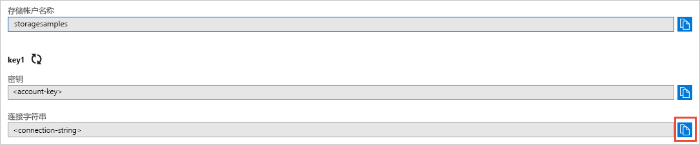

## 从 Azure 门户复制凭据

此示例应用程序需对存储帐户访问进行身份验证。 请为应用程序提供连接字符串形式的存储帐户凭据，以便进行身份验证。 若要查看存储帐户凭据，请执行以下操作：

1. 导航到 [Azure 门户](https://portal.azure.com)。
2. 找到自己的存储帐户。
3. 在存储帐户概述的“设置”部分，选择“访问密钥”。 此时会显示帐户访问密钥，以及每个密钥的完整连接字符串。   
4. 找到“密钥 1”下面的“连接字符串”值，单击“复制”按钮复制该连接字符串。 下一步需将此连接字符串值添加到某个环境变量。

    
