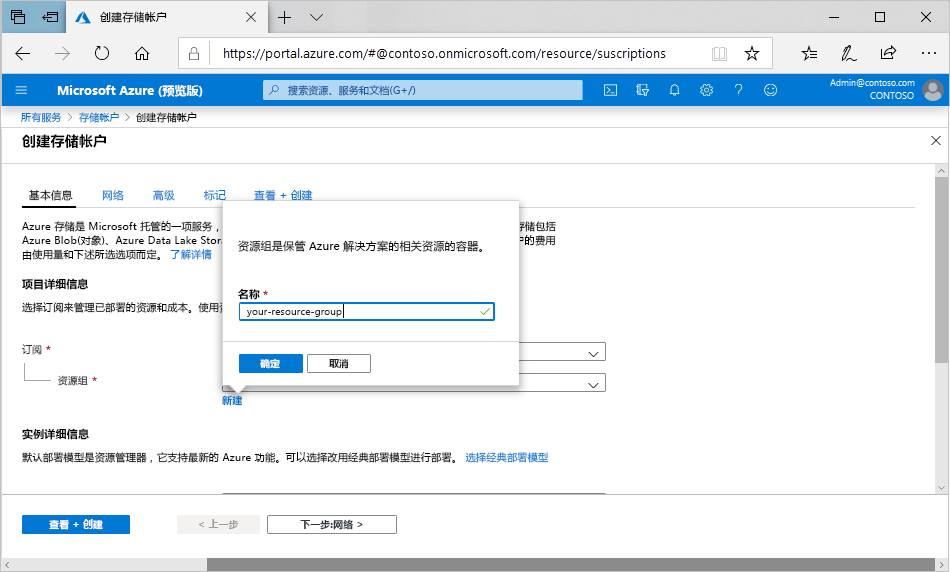

若要在 Azure 门户中创建常规用途 v2 存储帐户，请执行以下步骤：

1. 在 Azure 门户菜单中，选择“所有服务”  。 在资源列表中，键入“存储帐户”  。 开始键入时，会根据输入筛选该列表。 选择“存储帐户”  。
2. 在显示的“存储帐户”窗口中，选择“添加”。  
3. 选择要在其中创建存储帐户的订阅。
4. 在“资源组”  字段下，选择“新建”  。 输入新资源组的名称，如下图中所示。

    

5. 然后，输入存储帐户的名称。 所选名称在 Azure 中必须唯一。 该名称还必须为 3 到 24 个字符，并且只能包含数字和小写字母。
6. 选择存储帐户的位置或使用默认位置。
7. 将这些字段设置为其默认值：

   |字段  |值  |
   |---------|---------|
   |部署模型     |资源管理器         |
   |性能     |Standard         |
   |帐户类型     |StorageV2（常规用途 v2）         |
   |复制     |读取访问异地冗余存储 (RA-GRS)         |
   |访问层     |热         |

8. 如果计划使用 [Azure Data Lake Storage](https://azure.microsoft.com/services/storage/data-lake-storage/)，请选择“高级”  选项卡，然后将“分层命名空间”  设置为“启用”  。
9. 选择“查看+创建”  可查看存储帐户设置并创建帐户。
10. 选择“创建”  。

有关存储帐户类型和其他存储帐户设置的详细信息，请参阅 [Azure 存储帐户概述](https://docs.microsoft.com/azure/storage/common/storage-account-overview)。 有关资源组的详细信息，请参阅 [Azure 资源管理器概述](https://docs.microsoft.com/azure/azure-resource-manager/resource-group-overview)。 
