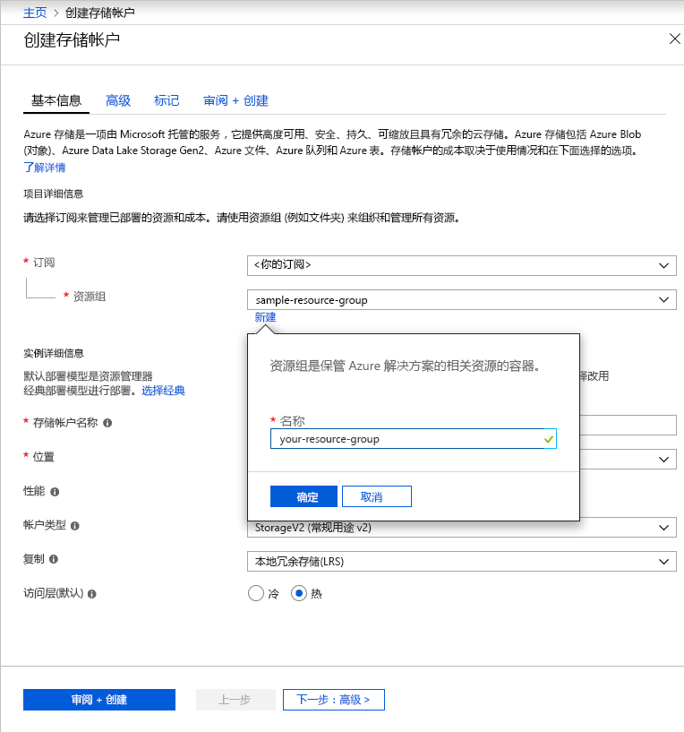

若要在 Azure 门户中创建常规用途 v2 存储帐户，请执行以下步骤：

1. 在 Azure 门户中展开左侧的菜单，打开服务菜单，然后选择“所有服务”。 然后向下滚动到“存储”，接着选择“存储帐户”。 在显示的“存储帐户”窗口中，选择“添加”。
1. 选择要在其中创建存储帐户的订阅。
1. 在“资源组”字段下，单击“新建”。 输入新资源组的名称，如下图中所示。

    

1. 然后，输入存储帐户的名称。 所选名称在 Azure 中需唯一，且必须为 3 到 24 个字符，并且只能包含数字和小写字母。
1. 选择存储帐户的位置或使用默认位置。
1. 将这些字段设置为其默认值：
    - “部署模型”字段默认设置为“资源管理器”。
    - “性能”字段默认设置为“标准”。
    - “帐户类型”字段默认设置为“StorageV2 (常规用途 v2)”。
    - “复制”字段默认设置为“本地冗余存储(LRS)”。
    - “访问层”默认设置为“热”。

1. 单击“查看+创建”可查看存储帐户设置并创建帐户。

有关存储帐户类型和其他存储帐户设置的详细信息，请参阅 [Azure 存储帐户概述](https://docs.microsoft.com/azure/storage/common/storage-account-overview)。 有关资源组的详细信息，请参阅 [Azure 资源管理器概述](https://docs.microsoft.com/azure/azure-resource-manager/resource-group-overview)。 
