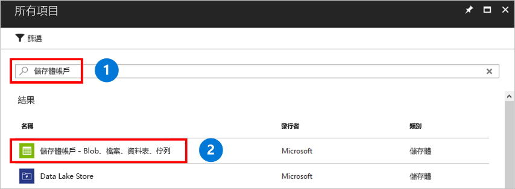

存储帐户是一个共享的存储池，可以在其中部署 Azure 文件共享或其他存储资源，例如 Blob 或队列。 一个存储帐户可以包含无数个共享。 一个共享可以存储无数个文件，直至达到存储帐户的容量限制为止。

创建存储帐户：

1. 在左侧菜单中，选择 **+** 来创建资源。
2. 在搜索框中，输入“存储帐户”，选择“存储帐户 - Blob、文件、表、队列”，然后选择“创建”。   
    

3. 在“名称”中，输入 *mystorageacct* 并后接一些随机数字，直到出现绿色对号，指明该名称是唯一的。 存储帐户名称必须全部为小写，且全局唯一。 记下存储帐户名称。 稍后将使用它。 
4. 在“部署模型”中，保留默认值“资源管理器”。   若要详细了解 Azure 资源管理器与经典部署模型之间的差别，请参阅[了解部署模型和资源状态](../articles/azure-resource-manager/management/deployment-models.md)。
5. 在“帐户类型”中，选择“StorageV2”。   若要详细了解不同类型的存储帐户，请参阅[了解 Azure 存储帐户](../articles/storage/common/storage-account-options.md?toc=%2fazure%2fstorage%2ffiles%2ftoc.json)。
6. 在“性能”，保留默认值“标准存储”。   Azure 文件目前仅支持标准存储；即使选择 Azure 高级存储，文件共享也会存储在标准存储中。
7. 在“复制”中，选择“本地冗余存储(LRS)”。   
8. 在“需要安全传输”中，我们建议始终选择“已启用”。   若要详细了解此选项，请参阅[了解传输中加密](../articles/storage/common/storage-require-secure-transfer.md?toc=%2fazure%2fstorage%2ffiles%2ftoc.json)。
9. 在“订阅”中，选择创建存储帐户时所使用的订阅。  如果只有一个订阅，则默认值应是该订阅。
10. 在“资源组”  中，选择“新建”  。 对于名称，输入 *myResourceGroup*。
11. 在“位置”中，选择“美国东部”。  
12. 在“虚拟网络”中，保留默认选项“已禁用”。   
13. 为了便于找到该存储帐户，请选择“固定到仪表板”。 
14. 完成后，选择“创建”以开始部署。 