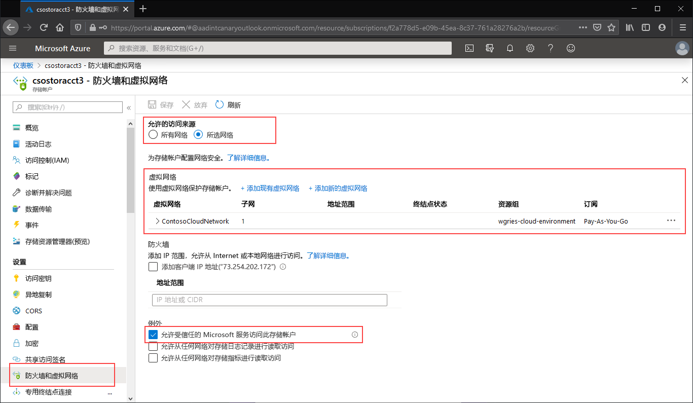

导航到仅限从特定虚拟网络访问公共终结点的存储帐户。 在该存储帐户的目录中，选择“防火墙和虚拟网络”。 

在页面顶部，选中“选定的网络”单选按钮。 随后会显示一些用于控制公共终结点限制的设置。 单击“+添加现有虚拟网络”，选择应允许其通过公共终结点访问存储帐户的特定虚拟网络。 这需要选择一个虚拟网络以及该虚拟网络的子网。 

选中“允许受信任的 Microsoft 服务访问此服务帐户”，以允许受信任的第一方 Microsoft 服务（例如 Azure 文件同步）访问存储帐户。

