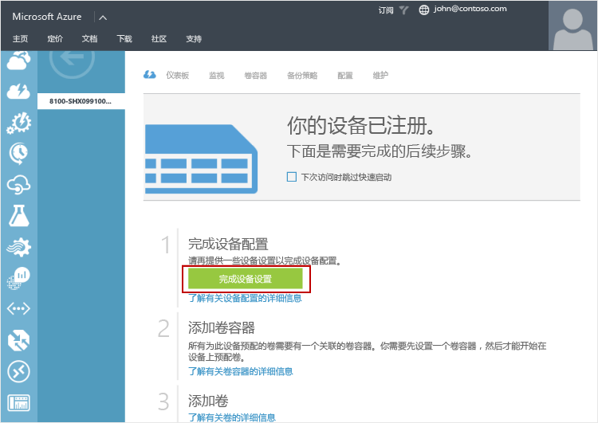
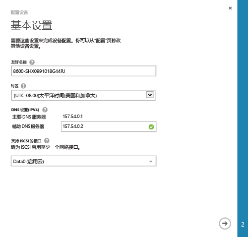
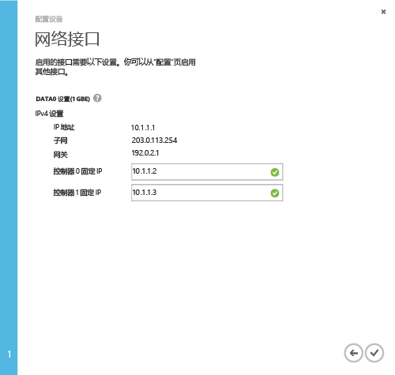

<!--author=alkohli last changed: 9/17/15-->

#### 完成最低要求的 StorSimple 设备设置

1. 在“设备”页上，选择该设备、单击设备名称的相应箭头转到特定设备页。

	

2. 单击快速启动图标  访问设备快速启动页。单击“完成设备设置”启动“配置设备”向导。

	

2. 在“基本设置”页上，执行以下操作：
  1. 为你的设备提供“友好名称”。默认设备名称可反映设备型号和序列号等信息。可分配最多包含 64 个字符的友好名称来管理设备。
  2. 基于部署设备的地理位置设置“时区”。设备将此时区用于所有计划操作。
  3. 在“DNS 设置”下，为“辅助 DNS 服务器”提供地址。如果使用的是 IPv6，将基于 Windows PowerShell 接口中提供的 IPv6 前缀填充字段。如果未配置辅助 DNS 服务器，则无法保存设备配置。
  4. 在启用 iSCSI 的接口下，为 iSCSI 启用至少一个网络。至少一个网络接口需要启用云，一个接口需要启用 iSCSI。DATA 0 自动启用云。
 
      

3. 单击箭头图标。

4. 在“网络接口”页上，为控制器 0 和控制器 1 提供固定 IP 地址。如果已为 IPv4 配置 DATA 0 接口，需要以 IPv4 格式提供固定 IP 地址。如果已为 IPv6 配置提供前缀，固定 IP 地址将自动填充到这些字段中。

	> [AZURE.NOTE] 
 	> 
 	> - 控制器的固定 IP 地址需为子网内可由设备 IP 地址访问的可用 IP。
 	> - 控制器的固定 IP 地址用于向设备提供更新，因此固定 IP 必须可路由并能够连接到 Internet。

    

5. 单击选中图标 。将返回到设备“快速启动”页。

 > [AZURE.NOTE] 通过访问“配置”页随时修改所有其他设备设置。

 **可用视频**

若要观看如何完成最低要求设备设置的演示视频，请单击[此处](https://azure.microsoft.com/documentation/videos/minimum-storsimple-device-setup/)。

<!---HONumber=AcomDC_0921_2016-->