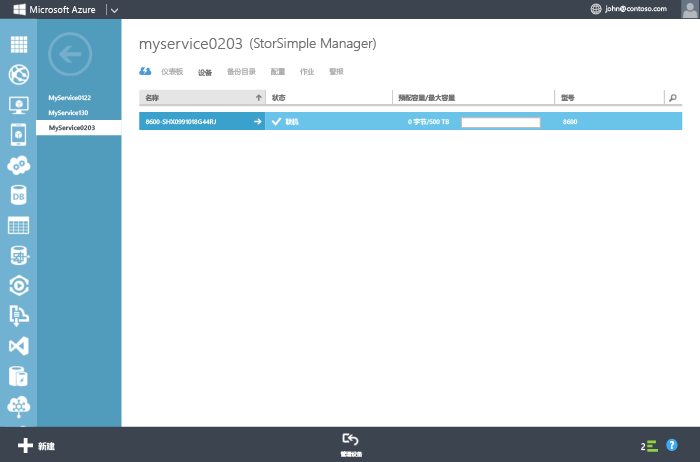

<!--author=alkohli last changed: 02/22/2016-->

### 配置和注册设备
1. 访问 StorSimple 设备串行控制台上的 Windows PowerShell 接口。 有关说明，请参阅 [使用 PuTTY 连接到设备串行控制台](#use-putty-to-connect-to-the-device-serial-console) 。 **请务必严格遵照该步骤，否则将无法访问控制台。**
2. 在打开的会话中，按一次 Enter 以启动命令提示符。 
3. 系统将提示你选择要为设备设置的语言。 指定语言后，按 Enter。 
   
    
4. 在显示的串行控制台菜单中，选择选项 1 以具有完全访问权限进行登录。 
   
    
   
     完成步骤 5-12 以配置设备的最低要求的网络设置。 **需要在该设备的主动控制器上执行这些配置步骤。** 串行控制台菜单指示标题消息中的控制器状态。 如果你未连接到主动控制器，请断开连接，然后连接到主动控制器。
5. 在命令提示符处，键入你的密码。 默认设备密码为 **Password1**。
6. 键入以下命令： `Invoke-HcsSetupWizard`。 
7. 此时将出现安装向导，帮助配置设置的网络设置。 提供以下信息： 
   
   * DATA 0 网络接口的 IP 地址
   * 子网掩码
   * 网关
   * 主 DNS 服务器的 IP 地址
     
        请注意，在执行过程的每个步骤后，系统会验证网络设置。
     
     > [!NOTE]
     > 应用子网掩码和 DNS 设置时，可能需要等待几分钟。 如果出现“检查与 DATA 0 的网络连接”错误消息，请检查主动控制器的 DATA 0 网络接口上的物理网络连接。
     > 
     > 
8. （可选）配置 Web 代理服务器。 尽管 Web 代理服务器配置是可选的，还是 **请注意，如果你使用 Web 代理，那么你只能在此处配置它**。 有关详细信息，请转到 [配置设备的 Web 代理](../articles/storsimple/storsimple-configure-web-proxy.md)。
9. 配置设备的主 NTP 服务器。 NTP 服务器是必需的，因为设备必须同步时间，才能向云服务提供程序进行身份验证。 确保网络允许 NTP 流量从数据中心传递到 Internet。 如果无法做到这一点，请指定一个内部 NTP 服务器。 
10. 出于安全原因，设备管理员密码将在第一个会话后过期，因此需要现在更改密码。 出现提示时，提供设备管理员密码。 有效的设备管理员密码必须介于 8 到 15 个字符之间。 密码必须包含以下各项的其中三个组合：小写字母、大写字母、数字和特殊字符。
    
     
11. 安装向导中的最后一步是向 StorSimple Manager 服务注册设备。 为此，将需要在步骤 2 中获取的服务注册密钥。 提供注册密钥后，可能需要等待 2-3 分钟，然后再注册设备。
    
    > [!NOTE]
    > 可以随时按 Ctrl+C 退出安装向导。 如果已输入所有网络设置（DATA 0 的 IP 地址、子网掩码和网关），将保留这些条目。
    > 
    > 
    
    
12. 注册设备后，将显示一个服务数据加密密钥。 复制此密钥并将其保存到一个安全位置。 **向 StorSimple Manager 服务注册其他设备时将需要此密钥以及该服务注册密钥。** 有关此密钥的详细信息，请参阅 [StorSimple 安全性](../articles/storsimple/storsimple-security.md) 。
    
        
    
    > [!NOTE]
    > 要复制串行控制台窗口中的文本，只需选择该文本。 然后应能够将其粘贴到剪贴板或任何文本编辑器中。 请勿使用 Ctrl + C 复制服务数据加密密钥。 使用 Ctrl+C 会导致退出安装向导。 这样做的结果是，将不会更改设备管理员密码，并且设备将还原为默认密码。
    > 
    > 
13. 退出串行控制台。
14. 返回到 Azure 经典门户并完成以下步骤：
    
    1. 双击 StorSimple Manager 服务，以访问“ **快速启动** ”页。
    2. 单击“ **查看连接的设备**”。
    3. 在“ **设备** ”页上，通过查看状态验证该设备是否已成功连接到该服务。 设备状态应为“ **联机**”。
       
         
       
        如果设备状态为“ **脱机**”，请等待几分钟以便设备联机。 
       
        如果几分钟后设备仍处于脱机状态，需要确保防火墙网络已按 [StorSimple 设备的网络要求](../articles/storsimple/storsimple-system-requirements.md)中所述进行配置。 
       
        确认端口 9354 已对出站通信打开，因为这将用于 StorSimple Manager 服务之间通信的服务总线。

