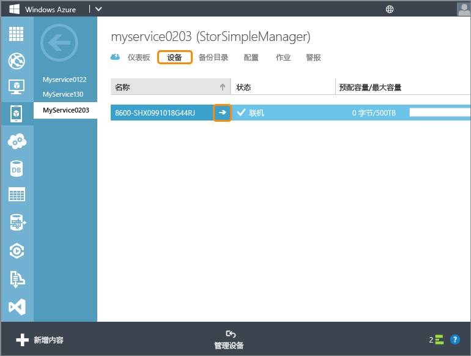

<!--author=alkohli last changed: 12/01/15-->

#### 配置和注册设备
1. 访问 StorSimple 设备串行控制台上的 Windows PowerShell 接口。有关说明，请参阅[使用 PuTTY 连接到设备串行控制台](#use-putty-to-connect-to-the-device-serial-console)。**请务必严格遵照该步骤，否则将无法访问控制台。**
2. 在打开的会话中，按一次 Enter 以启动命令提示符。
3. 系统将提示你选择要为设备设置的语言。指定语言后，按 Enter。
   
    
4. 在显示的串行控制台菜单中，选择选项 1 以具有完全访问权限进行登录。
   
    
   
     完成步骤 5-12 以配置设备的最低要求的网络设置。**需要在该设备的主动控制器上执行这些配置步骤。** 串行控制台菜单指示标题消息中的控制器状态。如果你未连接到主动控制器，请断开连接，然后连接到主动控制器。
5. 在命令提示符处，键入你的密码。默认设备密码为 **Password1**。
6. 输入以下命令：
   
     `Invoke-HcsSetupWizard`
7. 随后将出现安装向导，以帮助你配置设备的网络设置。提供以下信息：
   
   * DATA 0 网络接口的 IP 地址
   * 子网掩码
   * 网关
   * 主 DNS 服务器的 IP 地址
   * 主 NTP 服务器的 IP 地址
     
     > [!NOTE]
     > 应用子网掩码和 DNS 设置时，可能需要等待几分钟。如果出现“设备尚未就绪”的错误消息，请检查主动控制器的 DATA 0 网络接口上的物理网络连接。
     > 
     > 
8. （可选）配置 Web 代理服务器。尽管 Web 代理服务器配置是可选的，还是**请注意，如果你使用 Web 代理，那么你只能在此处配置它**。有关详细信息，请转到[配置你的设备的 Web 代理](../articles/storsimple/storsimple-configure-web-proxy.md)。如果在此步骤期间遇到任何问题，请参阅 [Web 代理配置期间发生的错误](../articles/storsimple/storsimple-troubleshoot-deployment.md#errors-during-the-optional-web-proxy-settings)故障排除指南。

      > [AZURE.NOTE] 可以随时按 Ctrl + C 退出安装向导。执行此命令前应用的任何设置都将被保留。

1. 出于安全原因，设备管理员密码将在第一个会话后过期，你将需要在后续会话中更改密码。出现提示时，提供设备管理员密码。有效的设备管理员密码必须介于 8 到 15 个字符之间。密码必须包含小写字符、大写字符、数字和特殊字符组合。
2. StorSimple Snapshot Manager 密码也在此设置。当使用运行 StorSimple Snapshot Manager 的 Windows 主机进行设备身份验证时将使用此密码。出现提示时，请提供一个 14 到 15 个字符的密码。密码必须包含以下项的其中三个组合：小写字母、大写字母、数字和特殊字符。
   
   
   
   可以从 StorSimple Manager 服务接口重置 StorSimple Snapshot Manager 密码。有关详细步骤，请转到[使用 StorSimple Manager 服务更改 StorSimple 密码](../articles/storsimple/storsimple-change-passwords.md)。
   
   若要排查此步骤期间出现的任何问题，请参阅[与密码相关的错误故障排除指南](../articles/storsimple/storsimple-troubleshoot-deployment.md#errors-related-to-device-administrator-and-storsimple-snapshot-manager-passwords)。
3. 安装向导中的最后一步使用 StorSimple Manager 服务注册设备。为此，将需要在步骤 2 中获取的服务注册密钥。提供注册密钥后，可能需要等待 2-3 分钟，然后注册该设备。
   
   若要排查任何可能的设备注册失败，请参阅[设备注册期间发生的错误](../articles/storsimple/storsimple-troubleshoot-deployment.md#errors-during-device-registration)。有关详细的故障排除，还可以参阅[逐步故障排除示例](../articles/storsimple/storsimple-troubleshoot-deployment.md#step-by-step-storsimple-troubleshooting-example)。
4. 注册设备后，将显示一个服务数据加密密钥。复制此密钥并将其保存在安全位置。
   
   > [!WARNING]
   > 向 StorSimple Manager 服务注册其他设备时将需要此密钥以及该服务注册密钥。有关此密钥的详细信息，请参阅 [StorSimple 安全性](../articles/storsimple/storsimple-security.md)。
   > 
   > 
   
    
   
    若要从串行控制台窗口复制文本，只需选择文本。然后应能够将其粘贴到剪贴板或任何文本编辑器中。请勿使用 Ctrl + C 复制服务数据加密密钥。使用 Ctrl + C 将导致你退出安装向导。这样做的结果是，将不会更改设备管理员密码和 StorSimple Snapshot Manager 密码，并且设备将还原为默认的密码。
5. 退出串行控制台。
6. 返回到 Azure 经典门户并完成以下步骤：
   
   1. 双击 StorSimple Manager 服务，以访问“**快速启动**”页。
   2. 单击“**查看连接的设备**”。
   3. 在“**设备**”页上，通过查看状态验证该设备是否已成功连接到该服务。设备状态应为“**联机**”。如果设备状态为“**脱机**”，请等待几分钟以便设备联机。
   
   
   
   > [!IMPORTANT]
   > 设备处于联机状态后，插入此步骤开始时拔下的网络电缆。
   > 
   > 

设备成功注册后没有进入联机状态，可以运行 `Test-HcsmConnection -Verbose` 以确保网络连接处于正常状态。有关此 cmdlet 的详细使用情况，请转到 [Test-hcsmconnection cmdlet 参考](https://technet.microsoft.com/library/dn715782.aspx)。

 **可用视频**

若要观看演示如何通过 Windows PowerShell for StorSimple 配置和注册设备的视频，请单击[此处](https://azure.microsoft.com/documentation/videos/initialize-the-storsimple-appliance/)。

<!---HONumber=AcomDC_0921_2016-->