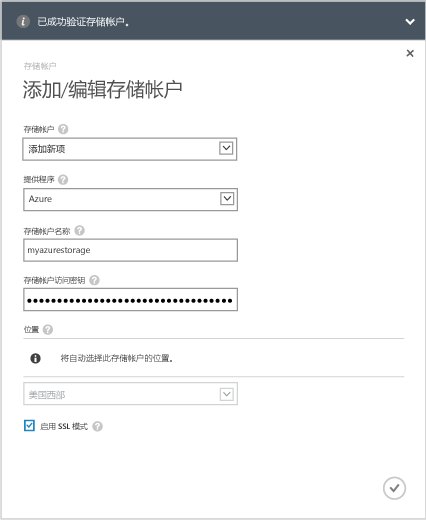
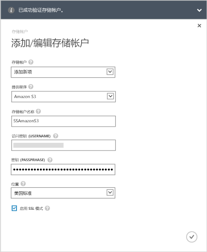
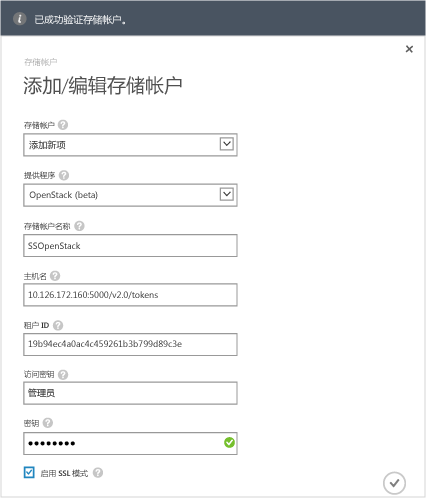

<!--author=alkohli last changed: 9/17/15-->

#### 在 StorSimple 8000 系列 Update 1.0 中添加存储帐户

1. 在 StorSimple Manager 服务登录页上，选择服务并双击。这将使你转到“**快速启动**”页。选择“**配置**”页。

2. 单击“**添加/编辑存储帐户**”。

3. 在“**添加/编辑存储帐户**”对话框中，单击“**新增**”。

4. 在**提供程序**字段中，选择适当的云服务提供程序。受支持的提供程序有 Azure、Amazon S3、带 RRS 的 Amazon S3、HP 以及 OpenStack。指定凭据以及与云服务提供程序的存储帐户关联的位置。根据指定的云服务提供程序，为凭证显示的字段将不同。
  - 如果已选择 Azure 作为云服务提供程序，则为 Microsoft Azure 存储帐户提供**名称**和主**访问密钥**。对于 Azure 帐户，将自动填充位置。

        

 - 如果已选择 Amazon S3 或带 RRS 的 Amazon S3，则提供一个友好**存储帐户名称**、**访问密钥**和**密钥**。对于 Amazon S3 和带 RRS 的 Amazon S3，支持以下位置：

		- US Standard
		- US West (Oregon)
		- US West (Northern California)
		- EU (Ireland)
		- Asia Pacific (Singapore)
		- Asia Pacific (Sydney)
		- Asia Pacific (Tokyo)
		- South America (Sao Paulo)

        
	  		
 - 如果已选择 HP 作为云服务提供程序，则提供一个友好**存储帐户名称**、**租户 ID**、**用户名**和 **密码**。对于 HP，支持以下位置：

		- US East
		- US West
	  
        
	  		
 - 如果已选择 **Openstack** 作为云服务提供程序，则提供**主机名**、**访问密钥**和**密钥**。

        > [AZURE.NOTE] For all the cloud service providers, excluding Azure, a friendly name is allowed. You can use different friendly names and create more than one storage account with the same set of credentials.

        

5. 选择“**启用 SSL 模式**”，以创建用于设备和云之间网络通信的安全通道。仅当在私有云内执行操作时清除“**启用 SSL 模式**”复选框。

      > [AZURE.NOTE] 如果使用 HP 作为提供程序，将始终启用 SSL。
  		
6. 单击选中图标 。你将收到成功创建存储帐户的通知。

7. 新创建的存储帐户将显示在“**存储帐户**”下的“**配置**”页上。单击“**保存**”，以保存新建的存储帐户。提示确认时单击“**确定**”。

<!---HONumber=AcomDC_0921_2016-->