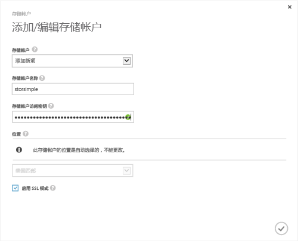

<!--author=SharS last changed: 9/17/15-->

#### StorSimple 发行版 (GA) 中添加新的存储帐户
1. 在 StorSimple Manager 服务的登录页面上，选择你的服务并双击它。 这将需要你**快速启动**页。 选择**配置**页。
2. 单击**添加/编辑存储帐户**。
3. 在**添加/编辑存储帐户**对话框框中，执行以下操作：
   
   1. 单击**添加新**。
   2. 提供你的存储帐户的名称。
   3. 提供主**访问密钥**为 Microsoft Azure 存储帐户。
   4. 选择**启用 SSL 模式**创建用于你的设备和云之间的网络通信的安全通道。 清除**启用 SSL 模式**复选框仅当你在私有云内进行操作。
   5. 单击复选图标 。 成功创建存储帐户后，你将收到通知。
      
      
4. 新创建的存储帐户将显示在**配置**下页上**存储帐户**。 单击**保存**以保存新创建的存储帐户。 单击**确定**当系统提示确认。

