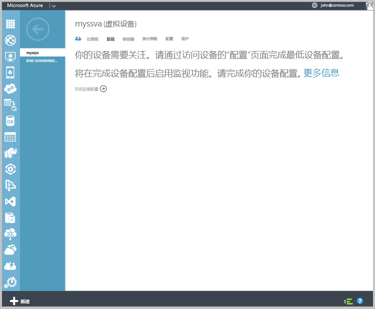
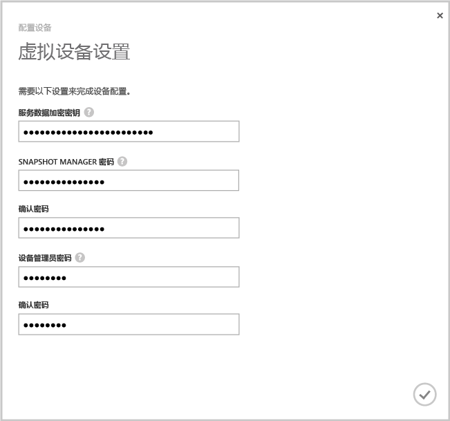

#### 配置和注册虚拟设备

1. 选择刚在“设备”  页中创建的 StorSimple 虚拟设备。
2. 单击“完成设备设置” 。 这将启动“配置设备向导”。
    
    

4. 在提供的空间中输入“服务数据加密密钥”  。

5. 输入指定长度和设置的 Snapshot Manager 和设备管理员密码。

6. 单击复选标记完成初始配置和虚拟设备注册。 
    
    

配置和注册完成后，设备将变为在线。 （设备可能需要几分钟时间才能联机。）

<!--HONumber=Jan17_HO1-->

