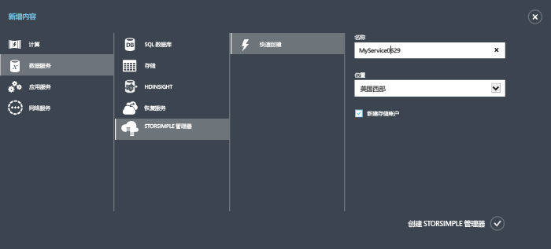
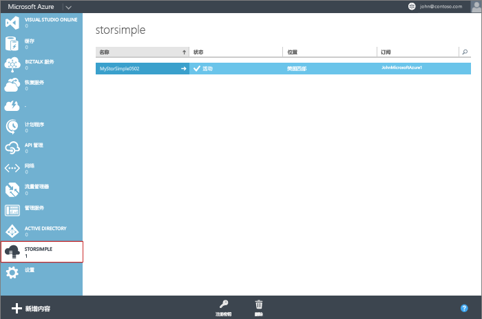

<!--author=alkohli last changed:01/14/2016-->

#### 创建新服务

1. 使用 Microsoft 帐户凭据登录到 Azure 经典门户，URL 为 [https://manage.windowsazure.com/](https://manage.windowsazure.com/)。

2. 在 Azure 经典门户中，依次单击“新建”>“数据服务”>“StorSimple Manager”>“快速创建”。

3. 在显示的表单中，执行以下操作：
  1. 为你的服务提供唯一“名称”。这是可用于标识该服务的友好名称。名称可以为 2 到 50 个字符，包括字母、数字和连字符。名称必须以字母或数字开头和结尾。
  2. 为服务提供“位置”。一般情况下，选择离要部署设备的地理区域最近的位置。还可能需要考虑以下因素：
	 
		- If you have existing workloads in Azure that you also intend to deploy with your StorSimple device, you should use that datacenter.
		- Your StorSimple Manager service and Azure storage can be in two separate locations. In such a case, you are required to create the StorSimple Manager and Azure storage account separately. To create an Azure storage account, go to the Azure Storage service in the Azure classic portal and follow the steps in [Create an Azure Storage account](storage-create-storage-account.md#create-a-storage-account). After you create this account, add it to the StorSimple Manager service by following the steps in [Configure a new storage account for the service](storsimple-deployment-walkthrough.md#configure-a-new-storage-account-for-the-service).
		 
  3. 从下拉列表中选择一个“订阅”。订阅链接到计费帐户。如果只有一个订阅，此字段不存在。
  4. 选择“新建存储帐户”自动通过该服务创建存储帐户。此存储帐户具有特殊名称，例如“storsimplebwv8c6dcnf”。 如果需要将数据存储在不同位置，请取消选中此框。
  5. 单击“创建 StorSimple Manager”创建服务。

   

  随后定向到“服务”登录页。创建服务需要几分钟时间。成功创建该服务后，用户将收到相应通知，服务状态将更改为“活动”。
 
   

 **可用视频**

若要观看如何新建 StorSimple Manager 服务的演示视频，请单击[此处](https://azure.microsoft.com/documentation/videos/create-a-storsimple-manager-service/)。

<!---HONumber=AcomDC_0921_2016-->