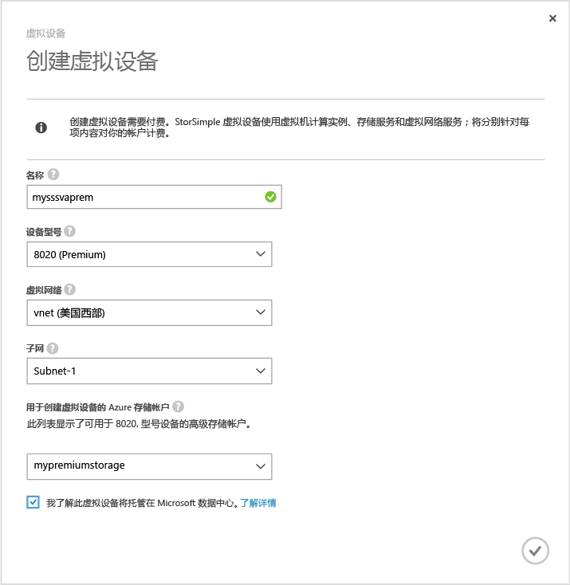
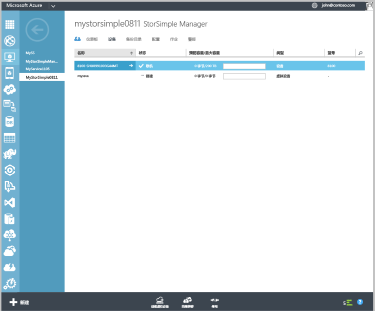

#### 创建虚拟设备

1.  在 Azure 门户中，转到“StorSimple Manager”服务。

2. 转到“设备”页。单击“设备”页底部的“创建虚拟设备”。

3. 在“创建虚拟设备”对话框中，指定以下详细信息。

     

	1. **名称** – 虚拟设备的唯一名称。

	2. **型号** – 选择虚拟设备的型号。只有在运行 Update 2 或更高版本时，才会显示此字段。8010 设备型号提供 30 TB 的标准存储，而 8020 提供 64 TB 的高级存储。指定 8010
	3.  从备份部署项目级别检索方案。选择 8020 部署高性能、低延迟工作负荷，或用作灾难恢复的辅助设备。
	 
	4. **版本** - 选择虚拟设备的版本。如果选择的是 8020 设备型号，则不会向用户显示版本字段。如果注册此服务的所有物理设备都运行 Update 1（或更高版本），则不会显示此选项。只有同时具备注册了相同服务且运行 Update 1 以及更早版本的物理设备，才显示此字段。由于虚拟设备的版本决定着可从其进行故障转移或克隆的物理设备，因此必须创建适当的虚拟设备版本。选择：

	   - 版本 Update 0.3，如果将从运行 Update 0.3 或更早版本的物理设备进行故障转移或灾难恢复。
	   - 版本 Update 1，如果将从运行 Update 1（或更高版本）的物理设备进行故障转移或克隆。
	   
	
	5. **虚拟网络** – 指定要用于此虚拟设备的虚拟网络。如果使用高级存储（Update 2 或更高版本），则必须选择支持高级存储帐户的虚拟网络。不支持的虚拟网络在下拉列表中呈灰显。如果选择不支持的虚拟网络，系统将发出警告。

	5. **用于创建虚拟设备的存储帐户** – 选择一个虚拟帐户用于在预配期间保留虚拟设备的映像。此存储帐户应与虚拟设备和虚拟网络位于同一个区域。该帐户不会用于存储物理或虚拟设备的数据。默认会创建一个新的存储帐户来存储设备的数据。但是，如果知道已有适用于存储设备数据的存储帐户，可以从列表中选择。如果创建高级虚拟设备，下拉列表中将仅显示高级存储帐户。

    	>[AZURE.NOTE] 虚拟设备仅适用于 Azure 存储帐户。StorSimple 虚拟设备不支持其他云服务提供程序，如 Amazon、HP 和 OpenStack，但物理设备支持。
	
	1. 单击勾号表示已了解虚拟设备中存储的数据将托管在 Microsoft 数据中心。仅使用物理设备时，加密密钥将保存在设备中，因此 Microsoft 无法解密。
	 
		使用虚拟设备时，加密密钥和解密密钥都存储在 Microsoft Azure 中。有关详细信息，请参阅[使用虚拟设备的安全注意事项](storsimple-security/#storsimple-virtual-device-security)。
	2. 单击勾号图标创建虚拟设备。设备可能需要 30 分钟左右的时间来预配。

	

    

<!---HONumber=AcomDC_0921_2016-->